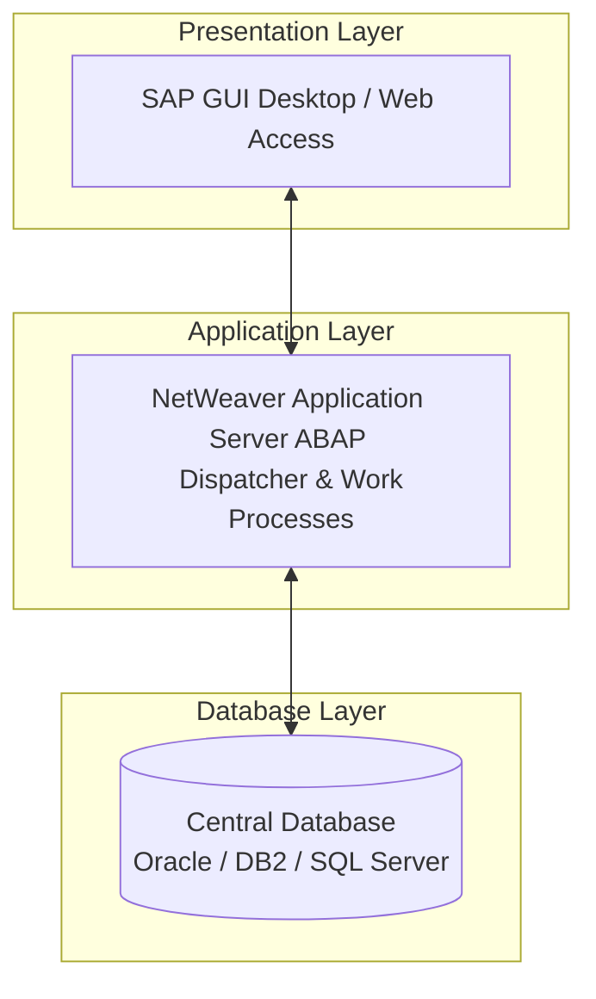

# SAP ECC Learning Repository

Welcome to the **SAP ECC Learning Repository**! This project serves as a comprehensive, structured knowledge base and educational portfolio designed for students, interns, beginners, and recruiters. It covers the core functional and technical aspects of SAP ERP Central Component (ECC).

---

## 🗺️ Learning Path & Quick Navigation Matrix

Use this navigation matrix to explore the repository's modules, business processes, and preparation materials:

| 📘 Introduction | 🏗️ Architecture | 📂 Modules | 🔄 Business Processes | 💼 Career & prep |
| :--- | :--- | :--- | :--- | :--- |
| [ERP & SAP Basics](file:///C:/Users/aditi/Documents/SAP.GIT/docs/introduction/introduction.md) | [3-Tier System Architecture](file:///C:/Users/aditi/Documents/SAP.GIT/docs/architecture/ecc_architecture.md) | [FI - Financial Accounting](file:///C:/Users/aditi/Documents/SAP.GIT/docs/modules/FI.md) | [Procure to Pay (P2P)](file:///C:/Users/aditi/Documents/SAP.GIT/docs/business-processes/procure-to-pay.md) | [Top 100 Interview Q&A](file:///C:/Users/aditi/Documents/SAP.GIT/docs/interview-preparation/top_100_questions.md) |
| [Landscape & NetWeaver](file:///C:/Users/aditi/Documents/SAP.GIT/docs/introduction/sap_landscape_basics.md) | [System Landscape & TMS](file:///C:/Users/aditi/Documents/SAP.GIT/docs/architecture/system_landscape.md) | [CO - Controlling](file:///C:/Users/aditi/Documents/SAP.GIT/docs/modules/CO.md) | [Order to Cash (O2C)](file:///C:/Users/aditi/Documents/SAP.GIT/docs/business-processes/order-to-cash.md) | [SAP Learning Roadmap](file:///C:/Users/aditi/Documents/SAP.GIT/docs/resources/learning_roadmap.md) |
| [Master Data & DDIC](file:///C:/Users/aditi/Documents/SAP.GIT/docs/introduction/master_data_concepts.md) | [RFC, IDocs, ALE & EDI](file:///C:/Users/aditi/Documents/SAP.GIT/docs/architecture/integration.md) | [MM - Materials Management](file:///C:/Users/aditi/Documents/SAP.GIT/docs/modules/MM.md) | [Plan to Produce (PtP)](file:///C:/Users/aditi/Documents/SAP.GIT/docs/business-processes/plan-to-produce.md) | [SAP Certification Guide](file:///C:/Users/aditi/Documents/SAP.GIT/docs/resources/certification_guide.md) |
| | | [SD - Sales & Distribution](file:///C:/Users/aditi/Documents/SAP.GIT/docs/modules/SD.md) | [Record to Report (R2R)](file:///C:/Users/aditi/Documents/SAP.GIT/docs/business-processes/record-to-report.md) | [Career Paths & Roles](file:///C:/Users/aditi/Documents/SAP.GIT/docs/resources/career_paths.md) |
| | | [PP - Production Planning](file:///C:/Users/aditi/Documents/SAP.GIT/docs/modules/PP.md) | [Hire to Retire (H2R)](file:///C:/Users/aditi/Documents/SAP.GIT/docs/business-processes/hire-to-retire.md) | [SAP Project Lifecycle](file:///C:/Users/aditi/Documents/SAP.GIT/docs/resources/project_lifecycle.md) |
| | | [QM - Quality Management](file:///C:/Users/aditi/Documents/SAP.GIT/docs/modules/QM.md) | | [T-Codes & Tables Index](file:///C:/Users/aditi/Documents/SAP.GIT/docs/resources/tcodes_reference.md) |
| | | [PM - Plant Maintenance](file:///C:/Users/aditi/Documents/SAP.GIT/docs/modules/PM.md) | | [Org Structure Guide](file:///C:/Users/aditi/Documents/SAP.GIT/docs/resources/org_structure_guide.md) |
| | | [HCM - Human Capital](file:///C:/Users/aditi/Documents/SAP.GIT/docs/modules/HCM.md) | | [Security & Spools Guide](file:///C:/Users/aditi/Documents/SAP.GIT/docs/resources/roles_authorization.md) |
| | | [WM - Warehouse Mgmt](file:///C:/Users/aditi/Documents/SAP.GIT/docs/modules/WM.md) | | [Learning Notes & Analogies](file:///C:/Users/aditi/Documents/SAP.GIT/docs/resources/learning_notes.md) |
| | | [BASIS - System Admin](file:///C:/Users/aditi/Documents/SAP.GIT/docs/modules/BASIS.md) | | |

---

## 🌟 Introduction to SAP ECC

### What is SAP ECC?
**SAP ERP Central Component (ECC)** is one of the most widely deployed Enterprise Resource Planning (ERP) software packages in the world. It provides a core suite of applications that integrates all functional areas of a business, ensuring real-time consistency and a single source of truth for corporate data.

### Why SAP ECC is Important in Enterprises
Large enterprises utilize SAP ECC to coordinate complex, global operations. By running a centralized database, a business can:
* **Eliminate Information Silos:** Connecting warehouse logistics, sales bookings, and bank ledgers seamlessly.
* **Ensure Regulatory Compliance:** Implementing strict audit logs, transaction tracking, and Separation of Duties (SoD).
* **Drive Efficiency:** Automating resource planning, reducing manual reconciliation times, and predicting supply chain bottlenecks.

### How SAP Supports Business Processes
SAP functions by standardizing common enterprise workflows (such as buying raw materials, paying vendors, selling products, and closing books) into structured, integrated transaction routes that flow automatically through general financial ledgers.

---

## 🏗️ SAP Architecture Overview

SAP ECC is built on the classic **R/3 3-Tier Client-Server Architecture** which isolates services to ensure high performance, security, and scalability:

* **Presentation Layer:** The user interface (SAP GUI) which captures user requests and renders screen fields.
* **Application Layer:** The business logic engine (NetWeaver AS ABAP) which hosts the Dispatcher, allocating user dialogs to available work processes (Dialog, Update, Batch, Spool, Enqueue).
* **Database Layer:** The central database hosting all master configuration definitions, transaction logs, and operational tables.

---

## 📂 Core SAP ECC Modules Covered

This repository covers the following core modules:

* **[SAP FI (Financial Accounting)](file:///C:/Users/aditi/Documents/SAP.GIT/docs/modules/FI.md):** External financial accounting, G/L ledgers, accounts payable/receivable, and asset depreciation.
* **[SAP CO (Controlling)](file:///C:/Users/aditi/Documents/SAP.GIT/docs/modules/CO.md):** Internal cost center management, internal orders, activity types, cost elements, and profitability analyses.
* **[SAP MM (Materials Management)](file:///C:/Users/aditi/Documents/SAP.GIT/docs/modules/MM.md):** Inventory control, vendor management, purchase orders, goods receipts, and OBYC automatic account allocations.
* **[SAP SD (Sales and Distribution)](file:///C:/Users/aditi/Documents/SAP.GIT/docs/modules/SD.md):** Customer master records, pricing conditions, shipping points, deliveries, and sales billing.
* **[SAP PP (Production Planning)](file:///C:/Users/aditi/Documents/SAP.GIT/docs/modules/PP.md):** BOMs, routings, work centers, material requirements planning (MRP), and shop floor production orders.
* **[SAP QM (Quality Management)](file:///C:/Users/aditi/Documents/SAP.GIT/docs/modules/QM.md):** Inspection lots, quality plans, results recording, usage decisions, and quality certificates.
* **[SAP PM (Plant Maintenance)](file:///C:/Users/aditi/Documents/SAP.GIT/docs/modules/PM.md):** Technical objects (functional locations, equipment), maintenance orders, counters, and technical completions.
* **[SAP HR/HCM (Human Capital Management)](file:///C:/Users/aditi/Documents/SAP.GIT/docs/modules/HCM.md):** Personnel administration infotypes, organizational units, time tracking, and payroll calculations.
* **[SAP WM (Warehouse Management)](file:///C:/Users/aditi/Documents/SAP.GIT/docs/modules/WM.md):** Advanced bin-level stock tracking, quants, storage types, and transfer orders.
* **[SAP Basis (System Administration)](file:///C:/Users/aditi/Documents/SAP.GIT/docs/modules/BASIS.md):** User master records, security profiles, background job scheduling, transport routes, and short dump diagnostics.

---

## 🔄 Module Integration & Business Cycles

Modules in SAP do not work in isolation. They are highly integrated, meaning a transaction in one module immediately triggers activities in another:

### Procure-to-Pay (P2P) Integration
The purchase requisition in **MM** triggers sourcing. Creating a Purchase Order creates commitments. Posting a Goods Receipt updates **MM** stock levels and triggers financial accounting postings in **FI**. The vendor invoice triggers invoice verification in **MM** and creates accounts payable liabilities in **FI**.

### Order-to-Cash (O2C) Integration
The Sales Order in **SD** reserves inventory in **MM**. The Outbound Delivery triggers picking. Posting Goods Issue updates **MM** physical stock and posts Cost of Goods Sold in **FI**. Billing generates the customer invoice in **SD** and writes sales revenues to **FI** General Ledgers.

---

## 🤝 Contributor Guidelines

This repository is an open educational resource. Contributions to improve or expand the documentation are welcome!

1. Fork the repository.
2. Create your feature branch (`git checkout -b feature/NewSAPGuide`).
3. Maintain consistent Markdown styling (use tables, Mermaid diagrams, and GitHub alerts where appropriate).
4. Do not upload any configuration codes or development scripts.
5. Open a Pull Request for review.