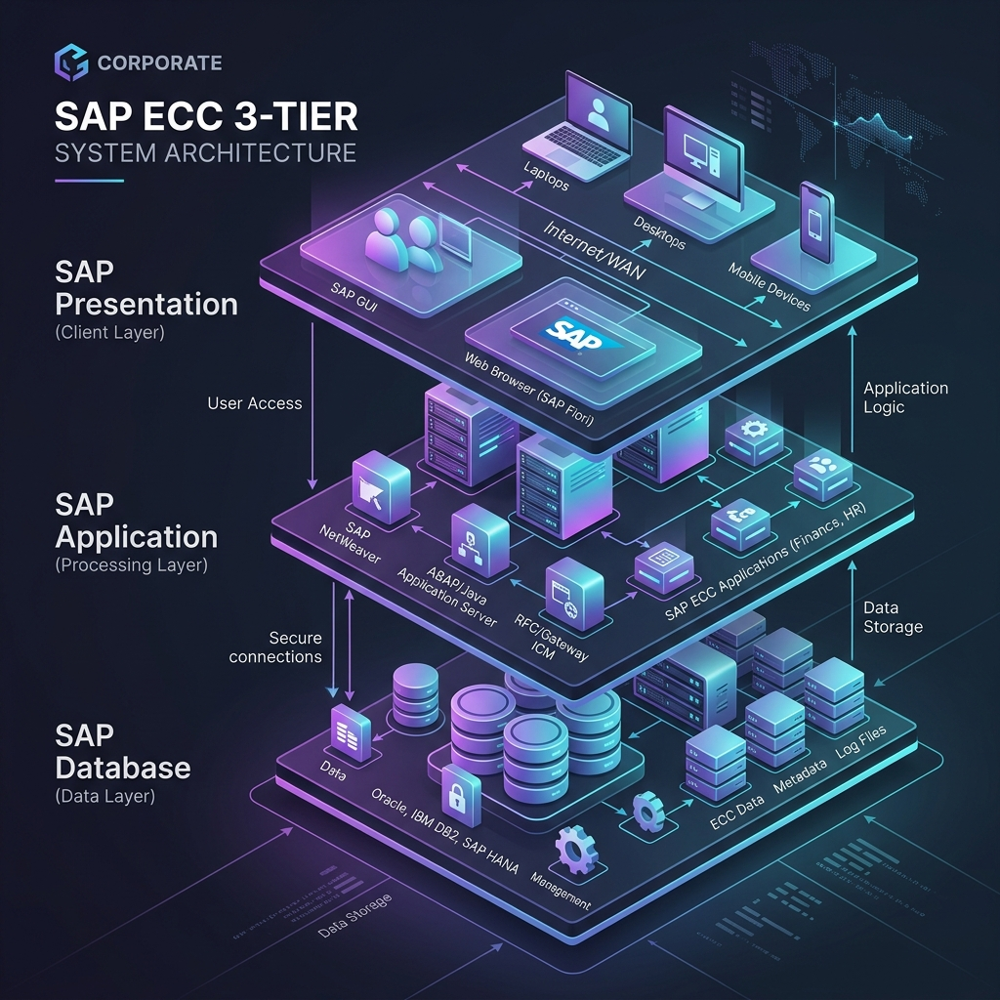

# SAP ECC Enterprise Knowledge Hub

[](https://www.sap.com)
[](#repository-structure)
[](#internship-relevance)
[](LICENSE)

Welcome to the **SAP ECC Enterprise Knowledge Hub**—an industry-grade repository compiling structural architectures, configuration guides, functional modules, and standard business workflows of SAP ERP Central Component (ECC).

This repository is designed as a **professional portfolio and interview preparation asset**, demonstrating structural mastery of ERP systems, business process integrations, and database landscapes.

---

## 🏛️ System Architecture

SAP ECC relies on the classic **3-Tier R/3 architecture** built on the NetWeaver integration suite. Below is a conceptual visualization of the system infrastructure:



---

## 📂 Repository Structure

The documentation is structured logically into modular files. Use the links below to navigate the knowledge base:

```
SAP.GIT/
│
├── 🏛️ [architecture/](architecture/)
│   ├── [ecc_architecture.md](architecture/ecc_architecture.md) - R/3 3-Tier, GUI layer, and NetWeaver
│   ├── [landscape.md](architecture/landscape.md)               - DEV/QAS/PRD environments, TMS, & TRs
│   └── [integration.md](architecture/integration.md)           - RFCs, IDocs structure, ALE, and EDI
│
├── 📦 [modules/](modules/)
│   ├── [mm.md](modules/mm.md)                                 - Materials Management (Procurement & Inventory)
│   ├── [sd.md](modules/sd.md)                                 - Sales and Distribution (Sales, Deliveries, Billing)
│   ├── [fico.md](modules/fico.md)                             - Financial Accounting (FI) & Controlling (CO)
│   ├── [pp.md](modules/pp.md)                                 - Production Planning (MRP, Work Centers, Routing)
│   ├── [wm.md](modules/wm.md)                                 - Warehouse Management (Bin level control)
│   ├── [hcm.md](modules/hcm.md)                               - Human Capital Management (Employee lifecycle)
│   └── [basis.md](modules/basis.md)                           - System Administration & Diagnostics
│
├── 🔄 [business-processes/](business-processes/)
│   ├── [p2p.md](business-processes/p2p.md)                     - Procure-to-Pay (P2P) flow
│   ├── [o2c.md](business-processes/o2c.md)                     - Order-to-Cash (O2C) flow
│   ├── [r2r.md](business-processes/r2r.md)                     - Record-to-Report (R2R) flow
│   ├── [h2r.md](business-processes/h2r.md)                     - Hire-to-Retire (H2R) flow
│   └── [plan_to_produce.md](business-processes/plan_to_produce.md) - Plan-to-Produce manufacturing flow
│
├── ⚙️ [configuration-guides/](configuration-guides/)
│   ├── [org_structure.md](configuration-guides/org_structure.md)   - Defining & Assigning Org Units
│   └── [roles_authorization.md](configuration-guides/roles_authorization.md) - PFCG Roles, Background Jobs, and Spools
│
├── 🗃️ [master-data/](master-data/)
│   └── [master_data_concepts.md](master-data/master_data_concepts.md) - Material/Vendor Master & DDIC (SE11)
│
├── 📊 [transactions/](transactions/)
│   └── [tcodes_reference.md](transactions/tcodes_reference.md)   - Cross-module Table & T-Code directory
│
├── 📝 [notes/](notes/)
│   └── [learning_notes.md](notes/learning_notes.md)             - Analogies, terms, and ASAP Lifecycle
│
└── 💼 [interview-questions/](interview-questions/)
    └── [interview_prep.md](interview-questions/interview_prep.md)       - Beginner, Intermediate, & Scenario-based Q&As
```

---

## 🚀 Key Learning Objectives & Coverage

This knowledge base covers the essential pillars of SAP functional and technical administration:

1. **Cross-Module Integration:** Explaining how business actions trigger automatic postings across MM, SD, and FICO (e.g., the role of the GR/IR clearing account).
2. **Configuration Mastery:** Detailed pathways in the custom SAP implementation menu (`SPRO`) for structuring companies, plants, sales organizations, and G/L accounts.
3. **Systems Administration (Basis):** Managing security permissions (`PFCG`), analyzing runtime program crashes (`ST22`), checking active lock blocks (`SM12`), and automating background executions (`SM36`/`SM37`).
4. **Data Management:** Defining database structures in the SAP Data Dictionary (`SE11`) and understanding Master Data lifecycle tracking.

---

## 💼 Internship Relevance & Portfolio Value

If you are presenting this repository for placements, internships, or professional networking:
* **Business Process Competence:** Demonstrates you do not just understand single transactions, but can trace a process flow (like P2P or O2C) from department requisition to G/L account reconciliation.
* **Technical Breadth:** Shows familiarity with SAP architecture (RFCs, IDoc status processing, transports, work processes) that normally requires years of hands-on experience.
* **Problem Solving:** Contains a dedicated [Interview & Business Scenarios Guide](interview-questions/interview_prep.md) modeling real production issues (such as credit blocks, dump reviews, and locked tables) and their resolutions.

---

## 🗺️ Future Roadmap

- [ ] Add SAP S/4HANA migration pathways and comparisons (Fiori vs GUI, database changes).
- [ ] Incorporate custom ABAP coding examples (User Exits, BAPIs, and reports).
- [ ] Add interactive mock test links for SAP MM/FICO certification preparation.

---

## 🤝 Contribution Guidelines

Contributions are welcome! If you find typographical errors, outdated T-code mappings, or wish to add a new business scenario:
1. Fork the repository.
2. Create a feature branch: `git checkout -b feature-improvement`.
3. Commit your changes with detailed summaries: `git commit -m "Add SD credit management steps"`.
4. Open a Pull Request.

---

## ✍️ Author

* **Vedika Manjarekar**
* GitHub: [@vedikamanjarekar](https://github.com/vedikamanjarekar)
* LinkedIn: [vedikamanjarekar](https://www.linkedin.com)
* Purpose: Placement Portfolio & Technical Documentation Hub