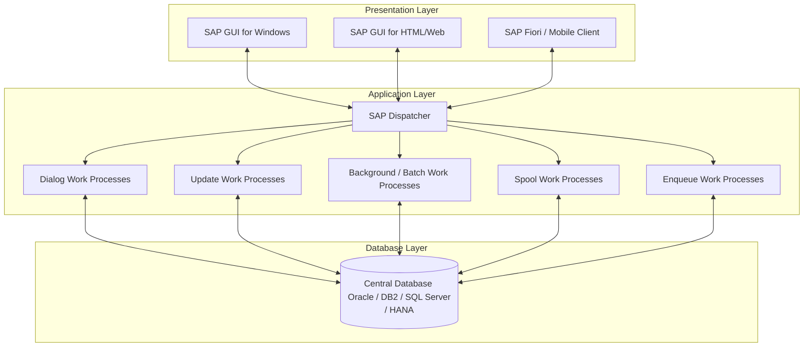
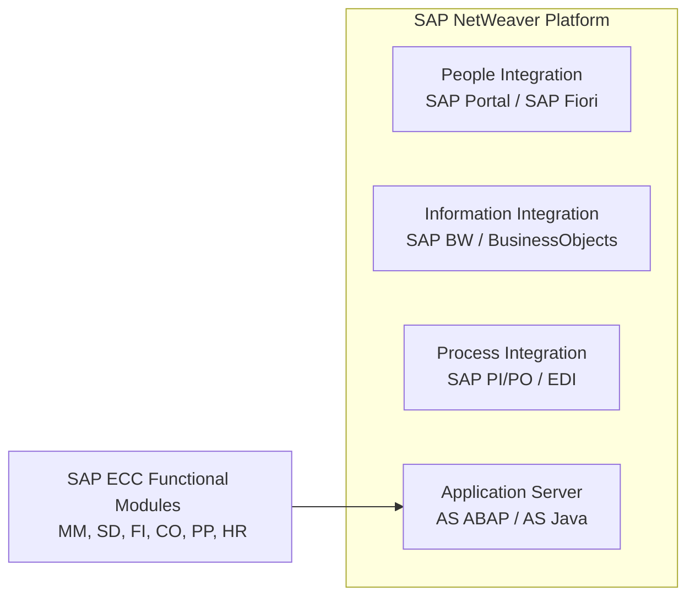

# SAP ECC Architecture

This document provides a comprehensive overview of the **SAP ERP Central Component (ECC)** architecture, detailing its underlying client-server structure, the presentation layer (SAP GUI), and the NetWeaver integration platform.

---

## 1. Introduction to SAP ECC

SAP ECC (ERP Central Component) is the core enterprise resource planning (ERP) software within the SAP Business Suite. It integrates key business functions of an organization, such as finance, sales, procurement, production, and human resources, into a single unified database. This integration ensures a single source of truth and real-time data consistency across all departments.

---

## 2. 3-Tier Client-Server Architecture

SAP ECC is built on the classic **R/3 architecture**, where "R" stands for Real-time and "3" represents the three separate logical tiers:

1. **Presentation Layer (Client)**
2. **Application Layer (Server)**
3. **Database Layer (Server)**

This client-server design ensures high scalability, load balancing, and independent development/maintenance of each layer.

### A. Presentation Layer
The presentation layer provides the user interface (UI). It translates user inputs (keystrokes, mouse clicks) into requests for the application server and displays the output data received back from the server.
* **SAP GUI (Graphical User Interface):** A desktop application installed on the client machine (Windows, macOS, Linux).
* **SAP GUI for HTML:** Renders SAP screens inside standard web browsers.
* **SAP Fiori:** The modern web UI framework (utilizing HTML5/SAPUI5) that sits on top of NetWeaver Gateway.

### B. Application Layer
The application layer contains the business logic. It consists of one or more application servers and a message server. The core software component here is the **SAP NetWeaver Application Server (AS ABAP)**.
* **SAP Dispatcher:** Receives requests from the presentation layer and distributes them to available work processes.
* **Work Processes (WPs):** Individual processes executing the ABAP programs:
  * **Dialog (DIA):** Processes interactive requests from users (e.g., loading a screen, running a transaction).
  * **Update (UPD/UP2):** Offloads database-writing tasks from Dialog processes to ensure fast user response times.
  * **Background (BTC):** Runs non-interactive batch programs or scheduled jobs.
  * **Spool (SPO):** Handles formatting and printing output redirection.
  * **Enqueue (ENQ):** Manages logical locks on business data to prevent concurrent modifications (concurrency control).

### C. Database Layer
The database layer contains the central database management system (DBMS) where all business data, configuration tables, program code, and master records are stored.
* Common databases for SAP ECC: Oracle, Microsoft SQL Server, IBM DB2, and SAP ASE.
* It communicates exclusively with the application layer; the presentation layer cannot access the database directly.

---

## 3. SAP NetWeaver Basics

**SAP NetWeaver** is the technical foundations platform on which SAP ECC and other Business Suite applications (like CRM, SRM, PLM) are built. It serves as an integration suite that links people, information, and business processes across organizational and technological boundaries.

### Key Components of SAP NetWeaver:
1. **AS ABAP and AS Java:** Provides the runtime environments for ABAP-based business logic (SAP ECC) and Java-based enterprise applications.
2. **SAP NetWeaver Portal (EP):** Provides role-based, single-point access to structured and unstructured information.
3. **SAP NetWeaver Process Integration (PI/PO):** Enables enterprise application integration (EAI) and service-oriented architecture (SOA) between SAP and non-SAP systems.
4. **SAP Business Warehouse (BW):** Collects, consolidates, and formats business data for reporting and analytical decision-making.

---

## Summary Key Terms

* **Client:** A self-contained unit in an SAP system with separate master records and its own set of tables (e.g., Client 100, Client 200).
* **ABAP (Advanced Business Application Programming):** The high-level programming language developed by SAP used to build ECC modules.
* **SAP Instance:** A group of administration processes in an SAP landscape containing a dispatcher, work processes, and common memory structures.
