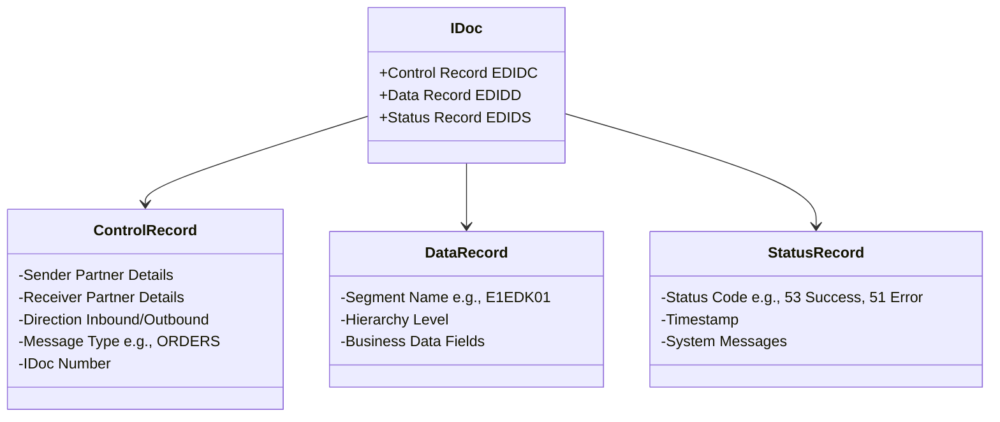
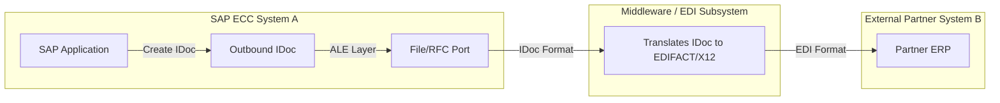

# SAP ECC Integration: RFC, IDocs, ALE & EDI

This document details the interface mechanisms SAP ECC uses to exchange data with external systems, including other SAP installations and third-party systems.

---

## 1. Remote Function Call (RFC)

An **RFC (Remote Function Call)** is the standard SAP interface communication mechanism. It executes a function module residing on a remote SAP system or non-SAP program (running outside the SAP system).

```mermaid
sequenceDiagram
    participant Sender as SAP Source System
    participant Receiver as Target System (SAP / Non-SAP)
    
    Note over Sender: Call Function Module <br> 'DESTINATION' Target
    Sender->>Receiver: 1. RFC Request (Data & Command)
    activate Receiver
    Note over Receiver: Process Remote Function
    Receiver-->>Sender: 2. RFC Response (Output/Exceptions)
    deactivate Sender
```

### Types of RFCs:
1. **Synchronous RFC (sRFC):**
   * **Behavior:** The calling system pauses and waits for the remote system to complete the task and return the results.
   * **Use Case:** Real-time inquiry (e.g., retrieving credit limits or inventory checks before confirming an order).
   * **Risk:** If the target system is down, the sender's process hangs or fails.
2. **Asynchronous RFC (aRFC):**
   * **Behavior:** The calling system initiates the call and continues its process immediately without waiting for the remote system to finish.
   * **Use Case:** Heavy parallel processing where data needs to be pushed but no instant return status is required.
3. **Transactional RFC (tRFC):**
   * **Behavior:** Similar to aRFC, but guarantees that the remote call is executed exactly once (using a unique transaction ID - TID) even if connection disruptions occur.
   * **Use Case:** Financial postings or stock updates where double-posting must be avoided.
4. **Queued RFC (qRFC):**
   * **Behavior:** An extension of tRFC. It ensures that multiple transactional calls are processed in a strict sequence (FIFO queue).
   * **Use Case:** Order processes where step B (Shipment) cannot be posted before step A (Order creation).

---

## 2. IDocs (Intermediate Documents)

An **IDoc** is a structured data container (a file-like format) used to exchange business data between systems asynchronously. It is independent of the sender and receiver systems.

### IDoc Structure:
Every IDoc consists of exactly three main parts:



1. **Control Record (`EDIDC`):** Contains administrative metadata (IDoc number, Direction: Inbound/Outbound, Message Type, Partner Type, Sender, Receiver).
2. **Data Record (`EDIDD`):** Contains the actual business data organized in hierarchical structures called **Segments**.
3. **Status Record (`EDIDS`):** Logs the processing milestones of the IDoc (e.g., status `03` = Data passed to port, `51` = Inbound Error, `53` = Application document posted successfully).

---

## 3. ALE (Application Link Enabling) & EDI (Electronic Data Interchange)

ALE and EDI are logical frameworks built on top of the IDoc technology:

* **ALE (SAP-to-SAP Integration):** Used to distribute master data (Material, Vendor, Customer) and transactional data across multiple distributed SAP systems.
* **EDI (SAP-to-Non-SAP Integration):** Used to transmit business documents (Invoices, Purchase Orders) between an SAP system and external trading partners (customers, vendors) using standardized industry formats (ANSI X12, EDIFACT).



### Components of ALE/EDI Configuration:
1. **Logical System (T-Code: `BD54`):** Defines the unique name representing an individual SAP system client or target platform.
2. **Port (T-Code: `WE21`):** Specifies the medium of transmission (RFC Port, File Port, XML Port).
3. **Partner Profile (T-Code: `WE20`):** Maps the outgoing/incoming Message Type (e.g., `ORDERS`) to the Port, Partner, and Process Code.
4. **Process Code (T-Code: `WE41` / `WE42`):** Links the IDoc processing to a specific ABAP functional module.

---

## Key T-Codes for Integration Administration

| T-Code | Description | Purpose |
| :--- | :--- | :--- |
| **SM59** | RFC Destinations | Configure and test remote connections (TCP/IP, ABAP connections). |
| **WE20** | Partner Profiles | Configure inbound/outbound partner parameters for ALE/EDI. |
| **WE02** / **WE05** | IDoc Lists | Search and monitor IDocs, inspect segment values, and verify status codes. |
| **WE19** | Test Tool | Re-process, clone, or debug inbound/outbound IDocs for troubleshooting. |
| **BD64** | Distribution Model | Define which master or transactional data is distributed to which logical system. |
| **SM58** | Transactional RFC Monitor | Diagnose errors in asynchronous tRFC/qRFC calls. |
| **BD87** | Inbound IDoc Processing | Re-trigger failed inbound IDocs after fixing data/configuration issues. |
