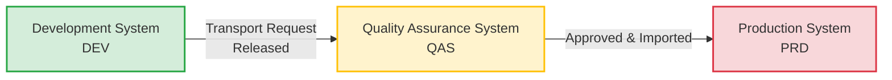

# SAP System Landscape & Transport Management System (TMS)

This document explains the standard structure of an SAP system environment (Landscape) and the mechanics of moving changes safely between these systems using the Transport Management System (TMS).

---

## 1. The 3-System Landscape

An SAP system landscape is the arrangement of SAP servers (systems) within an enterprise. To maintain system stability and prevent direct adjustments to active business processes, SAP strongly recommends a **3-System Landscape**:

### A. Development System (DEV)
* **Purpose:** Where all customization, configuration (customizing), and custom ABAP programming (workbench development) takes place.
* **Clients:** Often divided into multiple clients for sandbox testing, configuration, and unit testing:
  * **Sandbox (e.g., Client 100):** Temporary play area to experiment with configurations.
  * **Golden Configuration (e.g., Client 200):** Clean, source-controlled configuration area. No transactional data is kept here.
  * **Unit Testing (e.g., Client 300):** Developer test environment containing dummy/mock data.

### B. Quality Assurance System (QAS)
* **Purpose:** Where changes are thoroughly tested by business key users and Quality Assurance teams before going live.
* **Activities:** Integration testing, User Acceptance Testing (UAT), regression testing, and training.
* **Setup:** Configured identically to the production system with realistic master data.

### C. Production System (PRD)
* **Purpose:** The live system running the day-to-day business processes of the organization.
* **Rule:** No configuration or development is ever done directly in the Production system (except for some emergency fixes which must go through strict governance). Access to this environment is highly restricted.

---

## 2. Transport Management System (TMS)

The **Transport Management System (TMS)** is the SAP infrastructure used to manage, log, and execute transport requests (TRs) across the defined system landscape routes.

### A. What is a Transport Request (TR)?
A Transport Request is a package of system adjustments (configurations, code files, table definitions) that is recorded under a unique identifier.
* **TR Format:** `<SYS>K<Number>` (e.g., `DEVK900142` where `DEV` is the source system, `K` is the constant letter, and `900142` is a sequential number).
* **Components of a TR:**
  * **Task:** The sub-container assigned to individual developers/customizers.
  * **Object List:** The list of SAP tables, programs, or objects modified.

```mermaid
gantt
    title Transport Request Release and Import Lifecycle
    dateFormat  X
    axisFormat %s
    section Developer (DEV)
    Modify Configuration/Code :active, 0, 10
    Release Task               :done, 10, 12
    Release Transport Request  :done, 12, 14
    section QA Tester (QAS)
    Import TR to QAS           :crit, 14, 18
    User Acceptance Testing (UAT) :active, 18, 28
    section Administrator (PRD)
    Import TR to PRD           :milestone, 28, 30
```

### B. Types of Transport Requests
1. **Customizing Request:**
   * Contains client-dependent configurations (e.g., organizational structure assignments, payment terms, tax codes).
   * Affects only the client in which the configuration was made.
2. **Workbench Request:**
   * Contains client-independent objects (e.g., ABAP programs, DDIC table designs, SAP Smart Forms).
   * Affects all clients in the system immediately upon modification.

### C. Standard Workflow (Release & Import)

1. **Recording:** The developer or configurator performs work in DEV. The change is saved into a task under a Transport Request (T-Code: `SE09` or `SE10`).
2. **Releasing Tasks:** The individual task within the TR is released by the developer.
3. **Releasing TR:** Once all tasks under the TR are complete, the main Transport Request is released. Releasing compiles the changes and writes them as files onto the common operating system directory (known as `/usr/sap/trans`).
4. **Importing to QAS:** The Basis administrator logs into QAS and imports the TR (T-Code: `STMS`). The changes are now available for testing in QAS.
5. **Importing to PRD:** Once business sign-off is given in QAS, the TR is scheduled and imported into the live PRD system using `STMS`.

---

## Key T-Codes for Landscape Management

| T-Code | Description | Purpose |
| :--- | :--- | :--- |
| **SE09** | Transport Organizer | Manage and release custom workbench/customizing requests. |
| **SE10** | Transport Organizer (Extended) | Identical to SE09, used for developer transport administration. |
| **STMS** | Transport Management System | Import transports, configure transport routes, monitor queues. |
| **SCC1** | Client Copy | Copy changes directly between clients *within* the same physical system (e.g. DEV 200 to DEV 300) without releasing TRs. |
| **SE01** | Transport Organizer (Central) | Full system-wide overview of transport requests. |
| **SCC4** | Client Administration | Manage settings and control whether a client allows modifications. |
