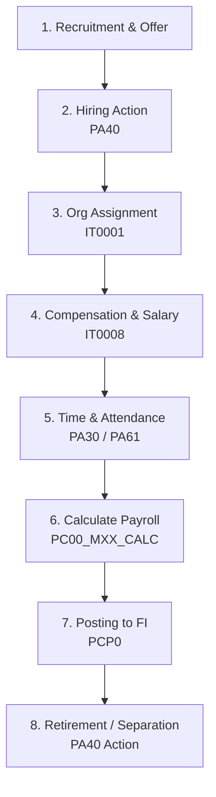

# Business Process: Hire to Retire (H2R)

This document provides a detailed end-to-end breakdown of the **Hire-to-Retire (H2R)** employee lifecycle business process in SAP ECC.

---

## 1. Process Flow Diagram

The following diagram illustrates the lifecycle of an employee, showing the integration of the Human Capital Management (HCM) sub-modules and Financial Accounting (FI) for payroll:

---

## 2. Process Steps, T-Codes, & Data Flow

| Step | Action Description | Primary T-Code | Core Tables Updated | Accounting Posting? |
| :--- | :--- | :--- | :--- | :--- |
| **1** | **Hiring Action**   Runs sequential screens to input new hire details. | `PA40` | `PA0000`, `PA0001`, `PA0002` | **No** |
| **2** | **Organizational Assignment**   Define employee's position and department. | `PPOME` / `PA30` | `PA0001`, `HRP1001` | **No** |
| **3** | **Setup Salary (Basic Pay)**   Define compensation and pay grade. | `PA30` (IT0008) | `PA0008` | **No** |
| **4** | **Capture Time & Absences**   Record work schedules, sick leave, vacations. | `PA61` | `PA2001`, `PA2002` | **No** |
| **5** | **Run Payroll**   Calculate gross pay, tax deductions, net payment. | `PC00_MXX_CALC` | `PAYR`, Cluster tables (PCL2) | **No** *(Calculations only)* |
| **6** | **Post Payroll to FI**   Export payroll expenses to Company Code accounts. | `PCP0` | `BKPF`, `BSEG` | **Yes**   Debit: Salary Expense   Credit: Net Pay Clearing |
| **7** | **Separation Action**   Execute termination or retirement checklist. | `PA40` | `PA0000` (Status set to inactive) | **No** |

---

## 3. Key Concepts of Payroll Integration

The boundary between HR and Finance is bridged at the **Posting to Financial Accounting** phase:
1. **Wage Types:** Every payment or deduction (e.g., Base Salary, Overtime, Health Insurance Premium) is represented by a Wage Type.
2. **Symbolic Accounts:** Rather than mapping Wage Types directly to G/L Accounts (which would require updating HR every time a G/L account changes), HR maps Wage Types to **Symbolic Accounts**.
3. **FI Mapping (T-Code: `OBYG` / `OBYE`):** The Symbolic Accounts are mapped directly to G/L Accounts (e.g., Symbolic Account `/101` for Base Salary maps to G/L Account `600000` - Employee Salaries).

---

## 4. Real-World Business Example

**Scenario:** Hiring and paying an office coordinator.
1. The recruiter uses T-Code `PA40` to execute the **Hiring** action on June 1st.
2. The wizard prompts for:
   * Personal details (Infotype `0002`)
   * Bank routing information (Infotype `0009`)
   * Position assignment (Infotype `0001` -> Office Coordinator)
   * Monthly salary of $4,000 (Infotype `0008`)
3. Throughout June, the employee logs 8 hours of vacation time (`PA61` -> Infotype `2001`).
4. On June 25th, the payroll administrator runs the **Payroll Driver** (`PC00_M10_CALC` for USA). The engine calculates:
   * Gross Pay: $4,000
   * Taxes: $800
   * Net Pay: $3,200
5. The administrator posts payroll to G/L (`PCP0`).
   * *Accounting entry:* Debit Salaries Expense ($4,000), Credit Taxes Payable ($800), and Credit Net Salary Cash Clearing ($3,200).
6. The bank transfer is executed via a direct clearing run, transferring $3,200 to the coordinator's personal bank account.
