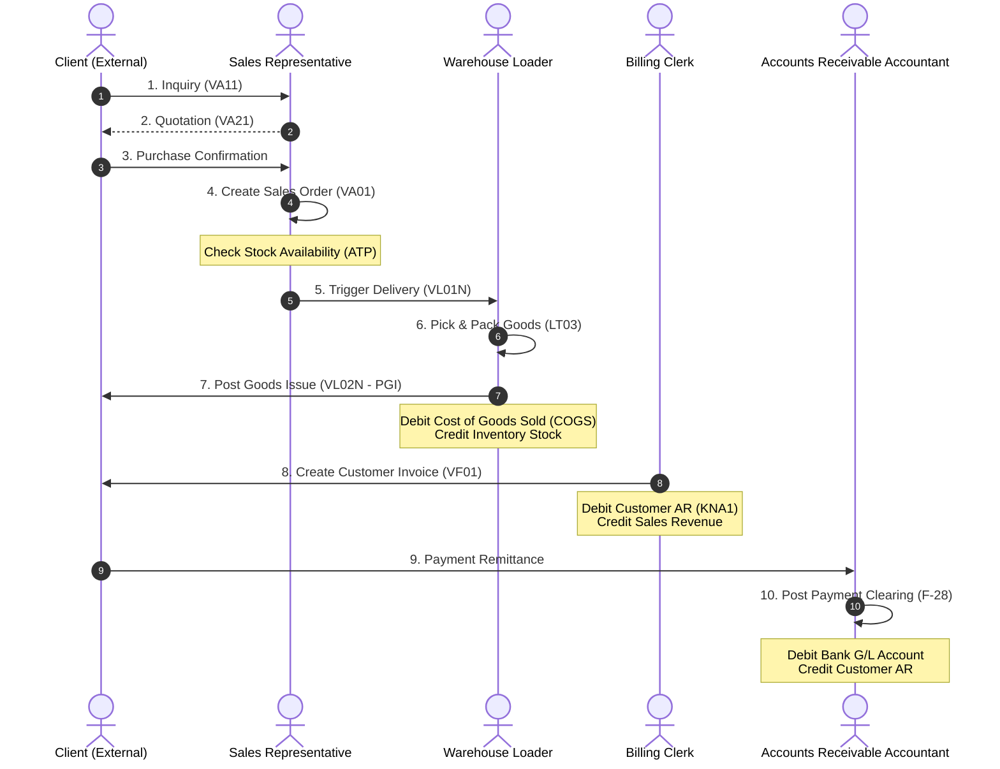

# Business Process: Order to Cash (O2C)

This document provides a detailed end-to-end breakdown of the **Order-to-Cash (O2C)** business cycle in SAP ECC.

---

## 1. Process Flow Diagram

The following diagram outlines the key milestones in the O2C cycle, showing the handoffs between the Sales & Distribution (SD) and Financial Accounting (FI) modules:

---

## 2. Process Steps, T-Codes, & Data Flow

| Step | Action Description | Primary T-Code | Core Tables Updated | Accounting Posting? |
| :--- | :--- | :--- | :--- | :--- |
| **1** | **Create Sales Order (SO)**   Legal commitment to supply goods to the customer. | `VA01` | `VBAK`, `VBAP` | **No** |
| **2** | **Create Outbound Delivery**   Prepare items for shipping. | `VL01N` | `LIKP`, `LIPS` | **No** |
| **3** | **Warehouse Picking**   Retrieve materials from bins (if WM is active). | `LT03` | `LTAP`, `LQUA` | **No** |
| **4** | **Post Goods Issue (PGI)**   Deliver goods to transport carrier. | `VL02N` | `MKPF`, `MSEG` | **Yes**   Debit: Cost of Goods Sold (COGS)   Credit: Inventory |
| **5** | **Generate Invoice (Billing)**   Bill the client for delivered goods. | `VF01` | `VBRK`, `VBRP` | **Yes**   Debit: Customer Accounts Receivable   Credit: Sales Revenue |
| **6** | **Receive Customer Payment**   Post incoming payment and clear invoice. | `F-28` | `BKPF`, `BSEG` | **Yes**   Debit: Bank Account   Credit: Customer Accounts Receivable |

---

## 3. Financial Integration & G/L Postings

The financial impacts of O2C occur at two distinct stages:

### At Post Goods Issue (PGI - T-Code `VL02N`):
* **Trigger:** Delivery document is closed for shipping.
* **Double-Entry:**
  * **Debit:** Cost of Goods Sold (COGS) Account ($500)
  * **Credit:** Finished Goods Inventory Account ($500)

### At Billing Document Creation (T-Code `VF01`):
* **Trigger:** Customer invoice is posted and transferred to accounts.
* **Double-Entry:**
  * **Debit:** Customer Accounts Receivable Subledger / G/L Account ($600)
  * **Credit:** Sales Revenue G/L Account ($600)
  * *(The difference of $100 represents the Gross Margin on this sale)*

---

## 4. Real-World Business Example

**Scenario:** A client orders 100 boxes of printer paper.
1. The sales representative creates a **Sales Order** (`VA01`). The system runs an Availability Check (ATP) confirming 150 boxes are in stock, and reserves 100 boxes for this order.
2. The shipping coordinator runs `VL01N` to create an **Outbound Delivery**.
3. A picker in the warehouse gathers the 100 boxes and marks them as picked (`VL02N` / `LT03`).
4. The truck is loaded, and the warehouse manager hits **Post Goods Issue** (`VL02N`).
   * *Accounting entry:* Debit COGS ($1,000) and Credit Paper Stock Inventory ($1,000).
5. The billing team prints the customer invoice via `VF01` for $1,500.
   * *Accounting entry:* Debit Customer Account ($1,500) and Credit Sales Revenue ($1,500).
6. The customer receives the invoice and completes a bank wire. The AR accountant registers the incoming cash through `F-28`, clearing the invoice.
   * *Accounting entry:* Debit Bank Cash ($1,500) and Credit Customer Account ($1,500).
