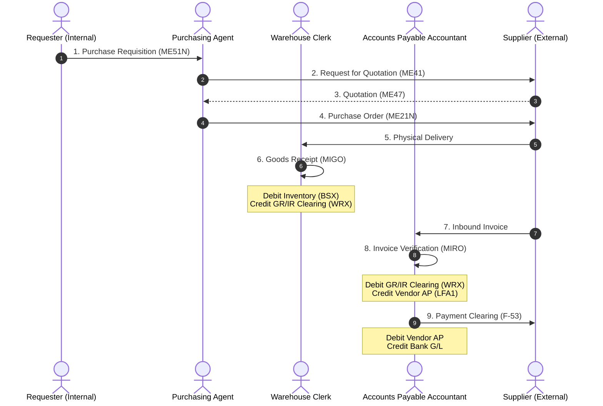

# Business Process: Procure to Pay (P2P)

This document provides a detailed end-to-end breakdown of the **Procure-to-Pay (P2P)** business cycle in SAP ECC.

---

## 1. Process Flow Diagram

The following flowchart illustrates the sequential steps of the P2P cycle, highlighting the integration between the Materials Management (MM) and Financial Accounting (FI) modules:

---

## 2. Process Steps, T-Codes, & Data Flow

| Step | Action Description | Primary T-Code | Core Tables Updated | Accounting Posting? |
| :--- | :--- | :--- | :--- | :--- |
| **1** | **Create Purchase Requisition (PR)**   Internal request to purchase material or service. | `ME51N` | `EBAN` | **No** |
| **2** | **Create Request for Quotation (RFQ)**   Send bid requests to various suppliers. | `ME41` | `EKKO`, `EKPO` | **No** |
| **3** | **Maintain Quotation Price**   Record prices returned by vendors. | `ME47` | `EKEK`, `EKPO` | **No** |
| **4** | **Create Purchase Order (PO)**   Legal purchase contract. | `ME21N` | `EKKO`, `EKPO` | **No** |
| **5** | **Post Goods Receipt (GR)**   Receive physical delivery of items. | `MIGO` | `MKPF`, `MSEG` | **Yes**   Debit: Inventory   Credit: GR/IR Clearing |
| **6** | **Post Invoice Receipt (IR)**   Log the vendor invoice and execute 3-way match. | `MIRO` | `RBKP`, `RSEG` | **Yes**   Debit: GR/IR Clearing   Credit: Vendor Account |
| **7** | **Execute Vendor Payment**   Clear accounts payable liability via bank. | `F-53` | `BKPF`, `BSEG` | **Yes**   Debit: Vendor Account   Credit: Outgoing Bank G/L |

---

## 3. Financial Integration & The GR/IR Clearer

The integration between inventory movements (MM) and financials (FI) is centered on the **GR/IR (Goods Receipt/Invoice Receipt) Clearing Account**.

### At Goods Receipt (GR - T-Code `MIGO`):
* **Transaction/Event Key:** `BSX` (Inventory Postings) and `WRX` (GR/IR Clearing).
* **Double-Entry:**
  * **Debit:** Stock/Inventory G/L Account ($1,000)
  * **Credit:** GR/IR Clearing Account ($1,000)

### At Invoice Verification (IR - T-Code `MIRO`):
* **Transaction/Event Key:** `WRX` (GR/IR Clearing) and Vendor AP subledger clearing.
* **Double-Entry:**
  * **Debit:** GR/IR Clearing Account ($1,000) *(clears the balance back to zero)*
  * **Credit:** Vendor Accounts Payable Account ($1,000)

---

## 4. Real-World Business Example

**Scenario:** A tech firm needs to buy 10 network routers.
1. The IT lead creates a **Purchase Requisition** (`ME51N`) for 10 routers.
2. The purchasing agent turns the requisition into a **Purchase Order** (`ME21N`) sent to Cisco, with a total cost of $5,000.
3. Cisco ships the routers. The receiving agent executes a **Goods Receipt** (`MIGO`), entering movement type `101`.
   * *Accounting entry:* Debit Stock ($5,000) and Credit GR/IR clearing ($5,000). The routers are now physically in the warehouse.
4. Cisco sends the invoice. The AP clerk uses `MIRO` to log the invoice. The 3-way match confirms that the PO price was $500 per router, the GR quantity was 10, and the invoice is for $5,000.
   * *Accounting entry:* Debit GR/IR clearing ($5,000) and Credit Cisco Vendor Account ($5,000).
5. At week-end payment runs, the AP accountant clears the invoice via **T-Code `F-53`**.
   * *Accounting entry:* Debit Cisco Vendor ($5,000) and Credit Cash/Bank G/L ($5,000).
