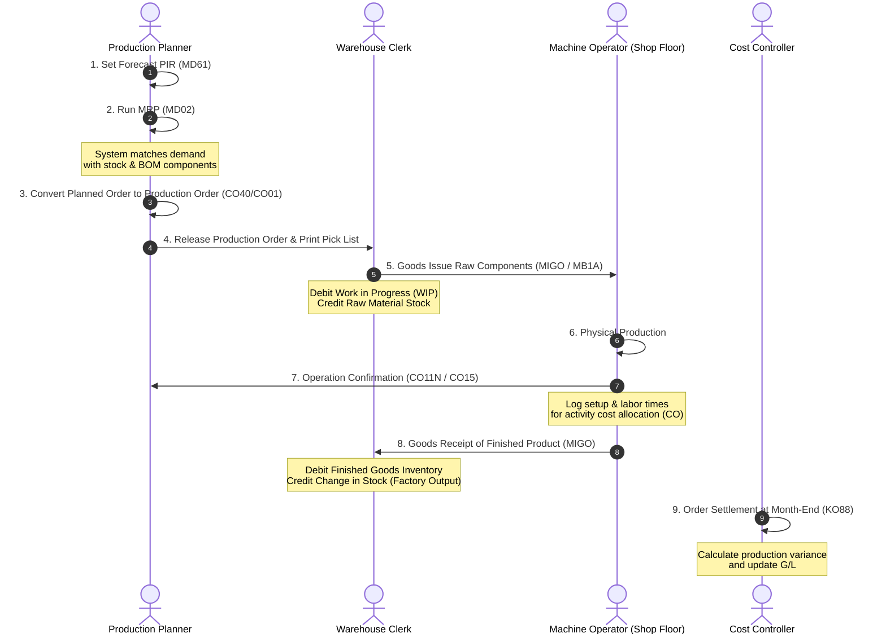

# Business Process: Plan to Produce

This document provides a detailed end-to-end breakdown of the **Plan-to-Produce** manufacturing business cycle in SAP ECC.

---

## 1. Process Flow Diagram

The following diagram illustrates the lifecycle of planning and executing manufacturing operations, highlighting the interaction between Production Planning (PP), Materials Management (MM), and Controlling (CO):

---

## 2. Process Steps, T-Codes, & Data Flow

| Step | Action Description | Primary T-Code | Core Tables Updated | Accounting Posting? |
| :--- | :--- | :--- | :--- | :--- |
| **1** | **Planned Independent Requirements (PIR)**   Load the sales forecasts into the system. | `MD61` | `PBIM`, `PBED` | **No** |
| **2** | **Execute MRP**   Calculate net component requirements. | `MD02` | `PLAF` (Planned Orders) | **No** |
| **3** | **Convert Planned Order to Production Order**   Lock in scheduled production resources. | `CO02` / `CO40` | `AUFK`, `AFKO`, `AFPO` | **No** |
| **4** | **Goods Issue to Production Order**   Send raw materials to assembly floor. | `MIGO` (Mov Type `261`) | `MKPF`, `MSEG` | **Yes**   Debit: Raw Mat Consumption   Credit: Raw Mat Stock |
| **5** | **Production Confirmation**   Log labor hours and machine setup times. | `CO11N` | `AFRU` | **No** *(FI-CO allocations only)* |
| **6** | **Goods Receipt of Finished Goods**   Receive completed product into warehouse. | `MIGO` (Mov Type `101`) | `MKPF`, `MSEG` | **Yes**   Debit: Finished Goods   Credit: Stock Change (Factory Output) |
| **7** | **Production Order Settlement**   Calculate actual cost vs standard cost differences. | `KO88` | `COSP`, `COSS`, `BSEG` | **Yes**   Debit/Credit: Cost Variance G/L |

---

## 3. Financial Integration & Shop Floor Movements

During manufacturing, two key material postings create accounting journals:

### A. Goods Issue of Raw Components (Movement Type `261`):
This issues materials out of the warehouse directly to the production order.
* **Double-Entry:**
  * **Debit:** Raw Material Consumption Expense Account ($300) *(assigned to the Production Order cost object)*
  * **Credit:** Raw Material Inventory G/L Account ($300)

### B. Goods Receipt of Finished Product (Movement Type `101`):
This records the delivery of finished goods from the shop floor back to the warehouse.
* **Double-Entry:**
  * **Debit:** Finished Goods Stock G/L Account ($500) *(valued at Standard Cost)*
  * **Credit:** Change in Stock / Production Output G/L Account ($500)

### C. Month-End Settlement (T-Code `KO88`):
At month-end, the actual raw materials consumed plus labor cost ($350) is compared against the standard cost value of output ($300). The $50 difference is a **Production Variance** that is cleared to G/L during order settlement.

---

## 4. Real-World Business Example

**Scenario:** A company manufactures wooden tables.
1. The forecast requires 50 wooden tables next month. The planner creates a **PIR** (`MD61`).
2. **MRP** (`MD02`) checks the inventory. It needs 50 table tops and 200 table legs. It creates a planned order.
3. The planned order is converted into **Production Order** `1000242`.
4. The worker picks the wood elements from the storage bins and posts a **Goods Issue** (`MIGO` - Mov Type `261`).
   * *Accounting entry:* Debit Wood Consumption Expense ($1,500), Credit Raw Wood Inventory ($1,500).
5. The operator completes assembly at the wood sanding station and logs 10 hours of machine time (**Confirmation** via `CO11N`). Controlling (CO) posts an allocation of $200 in labor costs to the Production Order.
6. The completed tables are sent to the warehouse. The lead posts a **Goods Receipt** (`MIGO` - Mov Type `101`).
   * *Accounting entry:* Debit Wooden Tables Inventory ($2,000) and Credit Factory Output Clearing ($2,000).
7. At month-end, the actual costs charged to the order are $1,700 ($1,500 wood + $200 labor) vs the standard finished value of $2,000. During **Settlement** (`KO88`), the $300 favorable variance is cleared to a Cost Variance G/L account.
