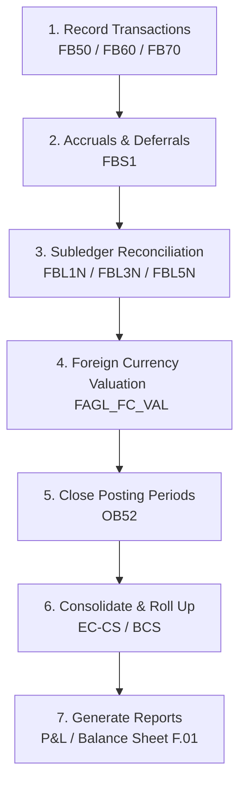

# Business Process: Record to Report (R2R)

This document provides a detailed end-to-end breakdown of the **Record-to-Report (R2R)** financial management cycle in SAP ECC.

---

## 1. Process Flow Diagram

The following diagram illustrates the standard tasks during the R2R cycle, showing the transition from transactional record keeping to institutional financial reporting:

---

## 2. Process Steps, T-Codes, & Data Flow

| Step | Action Description | Primary T-Code | Core Tables Updated | Accounting Posting? |
| :--- | :--- | :--- | :--- | :--- |
| **1** | **Record Journal Entries**   Post operational financial transactions. | `FB50`, `FB01` | `BKPF`, `BSEG`, `FAGLFLEXA` | **Yes** |
| **2** | **Post Accruals/Deferrals**   Post adjusting entries for current period expenses. | `FBS1` | `BKPF`, `BSEG` | **Yes** |
| **3** | **Depreciation Run**   Post calculated depreciation on physical assets. | `AFAB` | `ANLA`, `ANLC`, `BSEG` | **Yes**   Debit: Depr Expense   Credit: Accum Depr |
| **4** | **Foreign Currency Valuation**   Revalue foreign balances to exchange rates. | `FAGL_FC_VAL` | `FAGL_BSBW_H`, `BSEG` | **Yes** |
| **5** | **Close Posting Period**   Prevent further postings to the closed month. | `OB52` | `T001B` | **No** |
| **6** | **Generate Trial Balance / Reports**   Produce financial statements. | `F.01` | Reads `FAGLFLEXT` | **No** |

---

## 3. Key Concepts of Period-End Closing

Closing the financial books in SAP requires a strict sequence of steps to ensure accuracy:

1. **Subledger Reconciliation:** Checking that customer balances, vendor balances, and asset logs match the G/L Reconciliation Account totals.
2. **Accrual Engine Postings:** Automating recurring postings (e.g., insurance premiums paid annually but expensed monthly).
3. **Foreign Currency Valuation:** Revaluing accounts held in foreign currencies (e.g., an invoice in Euros outstanding on a US Dollar company code) to reflect current exchange rates at month-end.
4. **Closing Periods (OB52):** Locking period $N$ and opening period $N+1$ so operations staff cannot post back-dated items.

---

## 4. Real-World Business Example

**Scenario:** A company is closing its books for the month of April.
1. The accounting team reviews all standard journal entries.
2. The asset accountant executes the **Depreciation Run** (`AFAB`) to post $15,000 in machinery depreciation for April.
3. The GL team runs the **Foreign Currency Valuation** (`FAGL_FC_VAL`). A €10,000 open vendor invoice was posted when €1 = $1.10. At month-end, €1 = $1.12. The system adjusts the liability upwards by $200 and records an unrealized exchange loss.
4. The controller runs the **Post-Close Trial Balance** using `F.01` to check for anomalies.
5. Once approved, the finance director opens T-Code `OB52` and closes Period 4 (April) and opens Period 5 (May) for posting.
6. The final consolidated Profit & Loss statement and Balance Sheet are generated for corporate executives.
