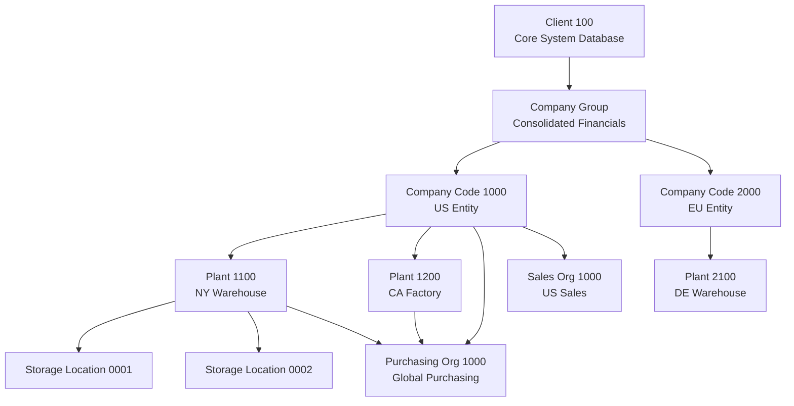

# Configuration Guide: Enterprise Organizational Structure

This guide provides a comprehensive blueprint of the SAP ECC **Enterprise Structure** configuration, showing how legal, financial, purchasing, and sales units are defined and linked together.

---

## 1. Enterprise Structure Hierarchy

An organizational structure forms the skeletal frame of any SAP system. It controls how business data flows between modules, how authorizations are restricted, and how financial statements are consolidated.

---

## 2. Core Organizational Definitions

### A. Financial Accounting (FI)
* **Client:** The highest logical level in the SAP system. All databases and configurations belong to a specific client.
* **Company (Group):** Represents a consolidated entity. Used for corporate aggregation.
* **Company Code:** The primary legal entity. It is the lowest level where independent financial statements (P&L and Balance Sheet) are generated.

### B. Materials Management (MM)
* **Plant:** A physical operational location where inventory is stored, manufacturing is performed, or distribution is executed.
* **Storage Location:** A physical subdivison of a Plant where materials are categorized (e.g., Raw Materials, Finished Goods, Scrap).
* **Purchasing Organization:** The organizational unit responsible for negotiating purchasing contracts and buying goods/services from vendors.

### C. Sales & Distribution (SD)
* **Sales Organization:** The legal entity responsible for selling products and services and handling product liability.
* **Distribution Channel:** The pathway through which goods reach customers (e.g., Wholesale, Retail, Direct Web Sales).
* **Division:** A classification grouping product ranges or services (e.g., Electronics, Spare Parts, Consultancy Services).
* **Sales Area:** A mandatory combination of **Sales Organization + Distribution Channel + Division** used to process any customer document.

---

## 3. Configuration Pathways (SPRO)

All enterprise structure steps are configured in the SAP Customizing Implementation Guide (T-Code: `SPRO`).

### Step 1: Definition Pathways
Define each entity individually:

* **Company Code:**
  `SPRO -> Enterprise Structure -> Definition -> Financial Accounting -> Edit, Copy, Delete, Check Company Code`
* **Plant:**
  `SPRO -> Enterprise Structure -> Definition -> Logistics - General -> Define, copy, delete, check plant`
* **Storage Location:**
  `SPRO -> Enterprise Structure -> Definition -> Materials Management -> Maintain storage location`
* **Purchasing Organization:**
  `SPRO -> Enterprise Structure -> Definition -> Materials Management -> Maintain purchasing organization`
* **Sales Organization:**
  `SPRO -> Enterprise Structure -> Definition -> Sales and Distribution -> Define, copy, delete, check sales organization`

### Step 2: Assignment Pathways
Establish relationships between entities (links the modules):

* **Assign Plant to Company Code (Integrates Logistics and FI):**
  `SPRO -> Enterprise Structure -> Assignment -> Logistics - General -> Assign plant to company code`
* **Assign Purchasing Org to Company Code:**
  `SPRO -> Enterprise Structure -> Assignment -> Materials Management -> Assign purchasing organization to company code`
* **Assign Purchasing Org to Plant (Enables purchase operations at plant):**
  `SPRO -> Enterprise Structure -> Assignment -> Materials Management -> Assign purchasing organization to plant`
* **Assign Sales Org to Company Code:**
  `SPRO -> Enterprise Structure -> Assignment -> Sales and Distribution -> Assign sales organization to company code`
* **Set up Sales Area (Combines Sales Org + Dist Channel + Division):**
  `SPRO -> Enterprise Structure -> Assignment -> Sales and Distribution -> Set up sales area`
* **Assign Sales Area to Plant:**
  `SPRO -> Enterprise Structure -> Assignment -> Sales and Distribution -> Assign sales organization - distribution channel - plant`
