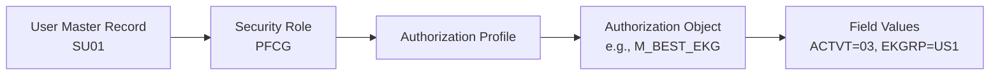
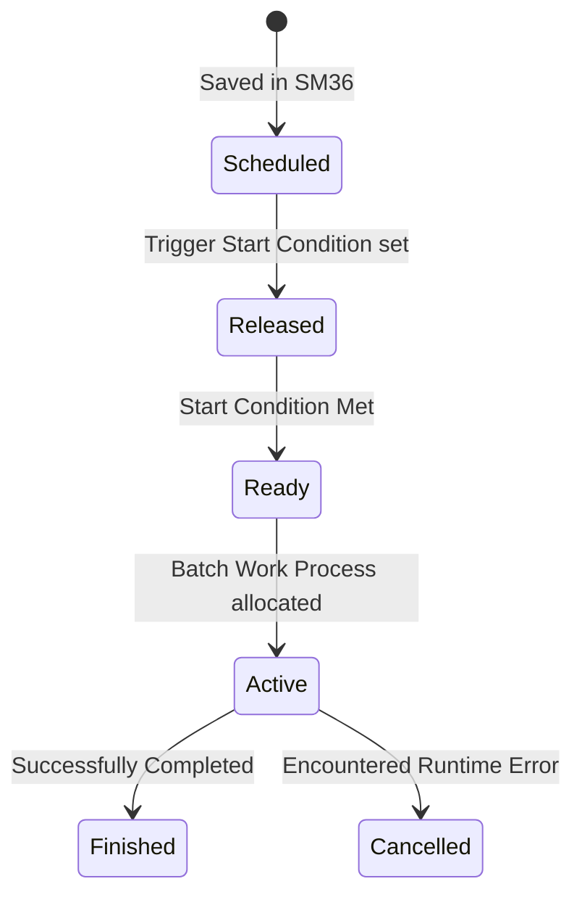

# Configuration Guide: Authorizations, Batch Jobs, Spools & Logs

This document provides a comprehensive guide for managing user permissions, automating tasks (background jobs), administering printing services (spools), and reading system logs/errors.

---

## 1. SAP Security & Roles (PFCG)

SAP security uses a role-based access control system. Instead of assigning permissions directly to users, permissions are packaged in **Roles** which generate authorization profiles.

### Key Security Definitions:
1. **Authorization Object:** The building block of security (e.g., `M_BEST_EKG` controls access to Purchase Orders based on Purchasing Group). It contains fields (like Activity, Purchasing Group) that can be restricted.
2. **Role Types (T-Code: `PFCG`):**
   * **Single Role:** A container of transaction codes, menus, and authorization settings.
   * **Composite Role:** A grouping of multiple single roles. Ideal for defining employee personas (e.g., "AP Accountant" contains roles for invoice creation, bank reconciliation, and vendor master viewing).
3. **User Comparison:** After assigning a role, the User Master Record must be reconciled (User Comparison) so the compiled profile is active.

---

## 2. Background Jobs (SM36 / SM37)

Background (batch) jobs are used to execute resource-heavy or recurring business tasks without occupying a dialog work process.

### Step-by-Step Scheduling (SM36):
1. **Define Job Name and Priority (Class A = High, Class C = Low).**
2. **Define Job Step:**
   * **Program:** The name of the ABAP report (e.g., `RSDEL01` to clear old logs).
   * **Variant:** Saved values for program input fields to run in headless mode.
   * **User:** The execution security context (often a system background user).
3. **Define Start Condition:**
   * Run immediately, scheduled at a specific date/time, triggered after a parent job, or scheduled on a recurring interval (daily, weekly, monthly).

---

## 3. Spool & Print Administration (SPAD)

The Spool System processes requests for paper output, email delivery, or file archiving:

* **Spool Request (T-Code `SP02` / `SP01`):** A temporary system print file containing document data.
* **Output Request:** The driver command that sends the spool file to the target printer.
* **SPAD Configuration:**
  * **Device Type:** The printer driver description (e.g., `POST2` for PostScript, `HPLJ4` for HP LaserJet).
  * **Access Method:** How SAP sends the print file to the OS spooler (e.g., `F` = Front-End Printing via SAP GUI, `U` = LPD/LPR protocol over Network).

---

## 4. Diagnostics & Error Handling (ST22 / SM21)

When a program fails, the Basis administrator uses diagnostic tools to determine the root cause:

### A. ABAP Short Dumps (ST22)
If an ABAP runtime error occurs, the program halts immediately, rolling back database changes, and logs a **Short Dump**.
* **Common Dumps:**
  * `ITAB_DUPLICATE_KEY`: Duplicate insert in a unique internal table.
  * `TIME_OUT`: A dialog process ran longer than the maximum timeout limit (often resolved by optimizing SQL queries or converting the process to a background job).
  * `GETWA_NOT_ASSIGNED`: Attempting to reference an unassigned field symbol.

### B. System Log (SM21)
Logs low-level database connection issues, locks, operating system anomalies, and work process changes. It is the first step in diagnosing system-wide network or server connection problems.
