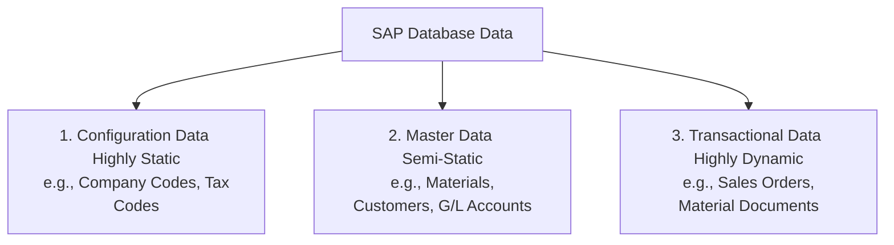
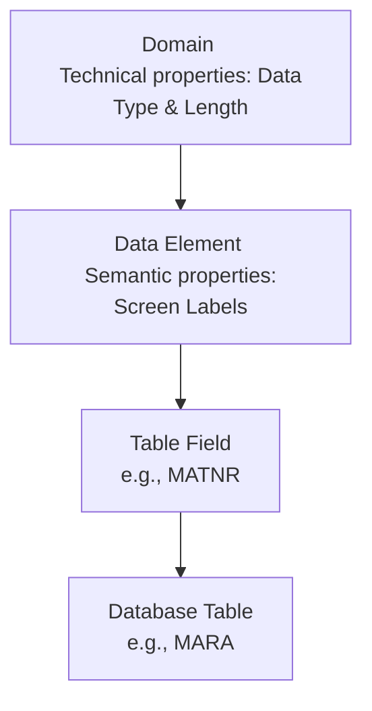

# Master Data & Data Dictionary (DDIC) Concepts

This document explains the classifications of data in an SAP system and the structural tools used to design databases in the **SAP Data Dictionary (DDIC)**.

---

## 1. Classification of Data in SAP

SAP data is divided into three primary categories based on its longevity, volatility, and purpose:

1. **Configuration (Customizing) Data:** Defines the business rules and organizational structure. It is maintained during implementation via `SPRO` and transported across the landscape.
2. **Master Data:** Represents core business entities that rarely change. It forms the baseline information for transaction processing (e.g., Material Master, Customer Master, Vendor Master, Cost Centers).
3. **Transactional Data:** Records day-to-day business transactions. Highly volatile and created constantly during business operations (e.g., invoices, delivery notes, purchase orders).

---

## 2. Core Master Data Objects

### A. Material Master (T-Codes: `MM01`/`MM02`/`MM03`)
Stores all physical and service-based items in a company. It is organized in a tabbed structure containing "views" owned by different departments:
* **Basic Data View:** General fields (Description, base unit of measure) valid for the entire company.
* **Purchasing View:** Fields used for purchasing controls (Purchasing group, tolerance levels) valid at the Plant level.
* **Sales View:** Fields used for selling (Tax classifications, delivering plant) valid at the Sales Area level.
* **MRP View:** Fields used for material requirements planning (MRP type, safety stock, reorder point) valid at the Plant/Storage Location level.

### B. Business Partner (Customer / Vendor) Master
* **Customer Master (`XD01`/`XD02`/`XD03`):** Details names, addresses, credit limits, reconciliation G/L accounts, and billing conditions.
* **Vendor Master (`FK01`/`FK02`/`FK03`):** Details payment terms, bank accounts, and purchasing currencies.

---

## 3. SAP Data Dictionary (DDIC) Basics (SE11)

The **Data Dictionary (DDIC)** is a central repository where database tables, structures, views, data types, and search helps are defined. It sits between the ABAP programs and the underlying database.

### Key DDIC Objects (T-Code `SE11`):
1. **Domain:** Defines the technical properties of a field (Data Type, Length, Value Range restrictions).
2. **Data Element:** Adds semantic meaning (context) to a Domain. It defines the screen field labels and headers that users see in the SAP GUI (e.g., Domain `CHAR18` might be used by Data Element `MATNR` representing "Material Number").
3. **Database Tables:** Definitions of tables stored in the physical database.
4. **Structures:** Group of fields defined in sequence, but *without* an underlying database table representation (used as temporary memory templates in ABAP programs).
5. **Views:** Logical joins of fields from multiple database tables to simplify data retrieval (e.g., View `V_EAN` lists materials and their barcode numbers).
6. **Search Help:** A dropdown window that allows users to search for master records (e.g., searching for a vendor by entering their city instead of their ID code).
