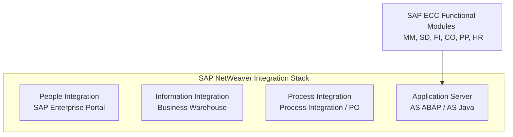

# SAP Landscape Basics & NetWeaver Foundation

This guide explains the foundational infrastructure elements of an SAP system, including the Client Concept, navigation in SAP GUI, and the role of the SAP NetWeaver platform.

---

## 1. The Client Concept

In SAP, a **Client** is the highest organizational and administrative level. It represents a self-contained commercial, organizational, and technical unit with its own set of tables, master data, transactional records, and user master records.

### The Apartment Building Analogy
To understand the technical boundaries of a client, think of the SAP system as an **Apartment Building**:

* **The Clients are Individual Apartments (e.g., Client 100, 200, 800):**
  * Each client is an isolated partition. Residents in Apartment 100 cannot look into Apartment 800.
  * They have their own furniture (Master Data like Materials, Customers, and Vendors) and their own mail (Transactional records like Purchase Orders and Invoices).
  * A transaction created in Client 100 is completely invisible in Client 800.
* **The Shared Building Foundation and Roof (Client-Independent Elements):**
  * All apartments share the same physical building structure, foundation, and main plumbing (Workbench Objects, such as ABAP program source code, table definitions, and screen layouts).
  * If you change an ABAP program in Client 100, that change affects the shared program code (Workbench) and is immediately active in Client 800.

### Client-Dependent vs. Client-Independent Data
| Data Type | Description | Scope | Examples | T-Code to Transfer |
| :--- | :--- | :--- | :--- | :--- |
| **Client-Dependent** | Data specific to a single client. | Only visible within that client. | Master Data (Materials, Customers), Transactions (PO, SO), Customizing (Company Codes, Payment terms). | `SCC1` (within system) / `STMS` (between systems) |
| **Client-Independent** | Data that applies globally to all clients. | Shared across the entire SAP system instance. | ABAP Program Code, Data Dictionary Structures (`SE11` tables), Printer definitions (`SPAD`). | Automatically changes across all clients |

---

## 2. SAP GUI Navigation & T-Codes

The **SAP GUI (Graphical User Interface)** is the standard desktop application used by end-users and consultants to log in and interact with SAP ECC.

### Common GUI Navigation Shortcuts
* **`/n`** (typed in the command field): Closes the current transaction and returns to the SAP Easy Access home screen.
* **`/n[T-Code]`** (e.g., `/nVA01`): Closes the current screen and opens the new transaction immediately in the same window.
* **`/o`**: Opens a pop-up window listing all active GUI sessions (max 6 sessions allowed simultaneously).
* **`/o[T-Code]`** (e.g., `/oMIGO`): Opens the new transaction in a **new session window**, keeping the current screen open.
* **`/nex`**: Closes all active sessions and logs off the system immediately without prompting to save.

### What is a T-Code (Transaction Code)?
An SAP **T-Code** is a 4-to-20 character alphanumeric shortcut representing a specific business transaction or administrative path. Users type it into the command field at the top-left of the GUI screen to bypass hierarchical menus.
* *Example:* Entering `VA01` opens the "Create Sales Order" screen, while navigating the folder tree would require: `SAP Easy Access Menu -> Logistics -> Sales and Distribution -> Sales -> Order -> VA01 - Create`.

---

## 3. SAP NetWeaver Foundation

**SAP NetWeaver** is the technical application platform on which SAP ECC and the rest of the SAP Business Suite (like CRM, SRM, PLM) are built. It serves as an integration suite that links people, information, and business processes.

### Four Pillars of NetWeaver Integration:
1. **People Integration:** Enables access to SAP workflows from web portals, mobile interfaces, or SAP Fiori.
2. **Information Integration:** Manages enterprise data analytics and reporting via SAP Business Warehouse (BW) and Master Data Management (MDM).
3. **Process Integration (PI/PO):** Coordinates data exchange and messaging patterns (XML/SOAP/B2B protocols) between SAP systems and third-party external applications.
4. **Application Platform (NetWeaver Application Server):** Provides the runtime engine for executing ABAP code (**AS ABAP**) and Java applications (**AS Java**).

---

> [!TIP]
> When customizing an SAP client, always ensure that your target client allows modifications. This is controlled via **T-Code `SCC4`** by Basis administrators to prevent accidental configuration edits in Golden clients or QA systems.
