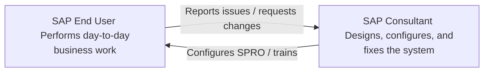

# SAP Career Paths & Consultant Roles

This guide explains the career progression in the SAP ecosystem, the various types of consultant roles, and the differences between an SAP End User and an SAP Consultant.

---

## 1. SAP End User vs. SAP Consultant

It is important to understand the division of labor in an organization using SAP:

| Dimension | SAP End User (Business User) | SAP Consultant (Functional/Technical) |
| :--- | :--- | :--- |
| **Primary Goal** | Runs the day-to-day operations of the company. | Configures, designs, and builds the SAP system. |
| **Activity** | Posts invoices, runs sales orders, executes goods receipts, logs employee time. | Gathers requirements, defines organizational structure in SPRO, creates tables, writes code, moves transports. |
| **Access Rights** | Restricted to operational transactions (e.g., `MIGO`, `VA01`, `FB60`). | Extensive administrative access (e.g., `SPRO`, `SE11`, `SU01`, `PFCG`, `STMS`). |
| **System View** | **SAP Easy Access Menu** (standard folder structure). | **SAP Customizing Reference IMG** (configuration menu). |
| **Career Origin** | Finance team, warehouse managers, HR coordinators, sales reps. | Information technology, business analysts, computer science graduates, domain experts. |

---

## 2. SAP Consultant Classifications

SAP projects require a team of specialists grouped into three main categories:

### A. Functional Consultants (e.g., FICO, MM, SD, PP, HCM)
* **What they do:** Translate business processes into system configurations. They sit down with business heads, write Business Blueprint (BBP) documents, configure SPRO parameters, and perform functional tests.
* **Key Skills:** Business domain expertise (e.g., GAAP rules for FI, inventory management logic for MM), SPRO customization knowledge, integration routing.

### B. Technical Consultants (ABAP Developers)
* **What they do:** Write custom program logic when standard SAP doesn't fit a company's specific needs. They build custom reports, modify user interface screens, set up automated database actions, and develop custom APIs.
* **Key Skills:** ABAP programming, Open SQL database queries, Object-Oriented design patterns, Smart Forms, User Exits, and BAdIs (Business Add-Ins).

### C. Basis / Infrastructure Administrators
* **What they do:** Keep the SAP system servers running. They manage database growth, monitor background work processes, set up system security/roles, and operate the Transport Management System.
* **Key Skills:** Server operating systems (Linux/Windows), database administration, network routing, SAP architecture, security profile management.

---

## 3. Career Progression Path

A typical career path for an SAP Consultant progresses as follows:

1. **Intern / Junior Consultant:**
   * Assists in documenting configurations and writing user manuals.
   * Performs basic configuration updates in DEV and unit testing.
   * Helps end-users resolve simple password blocks or transaction errors.
2. **Consultant (Mid-level):**
   * Independently designs sub-modules (e.g., setting up Accounts Payable or Sales Pricing).
   * Runs client meetings to document business blueprints.
   * Drafts Functional Specifications for ABAP developers to write custom code.
3. **Senior Consultant:**
   * Designs end-to-end integration cycles (e.g., configuring P2P or O2C across multiple countries).
   * Manages data migrations and cutover planning.
   * Reviews technical code and guides junior members.
4. **Lead Consultant / Solution Architect:**
   * Approves the global system architecture for multi-million dollar rollouts.
   * Controls the configuration governance rules across the corporate landscape.
   * Serves as the primary bridge between senior executive sponsors and technical implementation teams.
5. **Project Manager / Delivery Director:**
   * Manages the project timeline, budgets, resource allocations, and vendor coordination.
