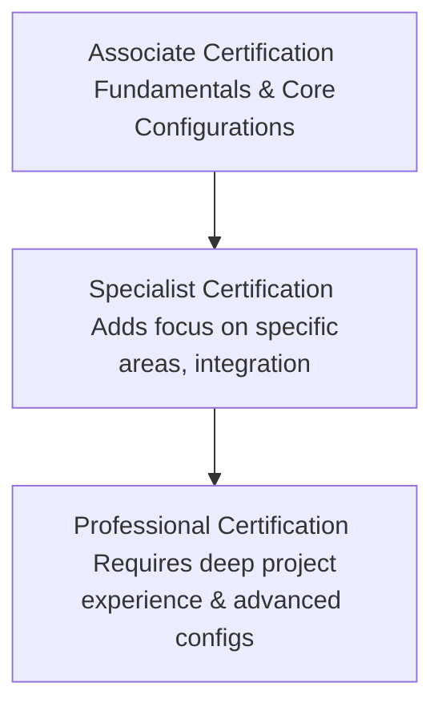

# SAP Certification Guide

An SAP Certification validates your technical knowledge and functional expertise to recruiters, companies, and consultancy firms. This guide outlines the structure of SAP certifications and the recommended exam tracks for beginners.

---

## 1. Types of SAP Certifications

SAP structures its exams into three progressive tiers:

1. **Associate Certification:** Designed for beginners, juniors, and newly trained consultants. It covers standard module configurations and core business process workflows.
2. **Specialist Certification:** Focuses on integration components or specific sub-modules (e.g., integrating SAP Ariba with MM, or specializing in SAP S/4HANA Finance Migration).
3. **Professional Certification:** Designed for senior consultants. Requires several years of project experience, in-depth system architecture understanding, and real-world implementation knowledge.

---

## 2. Key Certification Tracks for ECC & S/4HANA

Below are the most widely recognized certification tracks for functional and technical consultants:

| Module | Exam Code Description (Associate level example) | Focus Area |
| :--- | :--- | :--- |
| **Financial Accounting** | `C_TFIN52` (ECC) / `C_TS4FI` (S/4HANA) | General Ledger, accounts payable/receivable, assets. |
| **Management Accounting**| `C_TFIN22` (ECC) / `C_TS4CO` (S/4HANA) | Cost centers, profit centers, internal orders, costing. |
| **Materials Management** | `C_TSCM52` (ECC) / `C_TS452` (S/4HANA) | Purchasing configs, inventory management, account mapping. |
| **Sales & Distribution** | `C_TSCM62` (ECC) / `C_TS462` (S/4HANA) | Pricing condition records, delivery schedules, billing parameters. |
| **ABAP Programming** | `C_TAW12` (ECC) / `C_TAW12_S4` (S/4HANA) | Program logic, DDIC objects, Open SQL, class interfaces. |
| **Basis Administration** | `C_TADM51` (ECC) / `C_TADM` (S/4HANA) | Database admin, landscape transport system, user profiles. |

---

## 3. Preparation Strategy

If you are planning to take an SAP certification exam, follow this strategy:

* **Review the Topic Weightage:** SAP lists the exact percentage weight of each topic block on the exam page (e.g., 20% on Pricing, 12% on Delivery in the SD exam). Focus on high-weight areas.
* **Study Official SAP Courses (T-Codes & Books):** Official SAP Academy materials (e.g., TS410 for Business Process Integration, TSCM50 for MM procurement) are the source material for all exam questions.
* **Practice in a Sandbox System:** Theoretical study is insufficient. Log into an SAP sandbox client and manually execute the configurations described in the study guides.
* **Review Sample Questions:** Review the sample questions provided on the SAP Training page to understand the multiple-choice formats.
* **Time Management:** Standard exams consist of 80 multiple-choice questions with a time limit of 180 minutes. The passing score varies between 60% and 70%.
