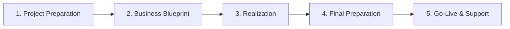

# SAP ECC Beginner Learning Notes

Welcome! If you are new to SAP, the terminology can feel like a foreign language. This document translates complex SAP concepts into simple, real-life analogies and outlines how companies implement SAP.

---

## 1. Real-World Analogies for Core Concepts

### A. The Client: The Apartment Building
* **SAP Concept:** A Client (e.g., Client `100`, Client `800`) is an isolated partition inside the SAP database.
* **Analogy:** Think of an SAP instance as an **Apartment Building**, and each **Client** as a separate apartment unit.
  * Residents in Apartment 101 cannot see inside Apartment 800.
  * They have their own furniture (Master Data like Materials and Vendors) and their own mail (Transactional records like Orders).
  * However, they share the same building foundation, roof, and plumbing (Workbench objects like ABAP code and screen designs). If you repaint the hallway (modify code), everyone sees it.

### B. Master Data vs. Transactional Data: The Recipe vs. The Order
* **SAP Concept:** Master Data is static baseline data. Transactional Data is fast-moving operational data.
* **Analogy:** Think of running a restaurant:
  * **Master Data:** This is your **Menu** and your **Recipe book**. The recipe for "Cheese Pizza" (Material Master) lists 1 crust, 1 cup of cheese, and 1/2 cup of sauce (BOM). It doesn't change day-to-day.
  * **Transactional Data:** This is the **Customer Order Ticket**. Table 4 orders 2 Cheese Pizzas on Friday at 7 PM. This transaction happens once, gets paid for, is archived, and goes away. It references the master recipe to know how to bake it.

### C. The GR/IR Clearing Account: The Post-it Note
* **SAP Concept:** GR/IR clearing matches Goods Receipt values with Invoice Receipt values.
* **Analogy:** You buy a laptop from a friend for $500.
  * When your friend hands you the laptop (**Goods Receipt**), you don't pay him immediately, but you have the laptop. You write a **Post-it Note** saying *"I owe my friend $500 for a laptop"* and stick it on your desk (Credit GR/IR).
  * When your friend sends you the text bill (**Invoice Receipt**), you take the Post-it note off the desk, throw it away (Debit GR/IR), and write a formal entry in your checkbook showing a liability to your friend's bank account.

---

## 2. SAP Implementation Lifecycle (ASAP Methodology)

Implementing SAP in a large corporation is a massive project. SAP created the **ASAP (Accelerated SAP) Methodology** to structure this journey into five clear phases:

### Phase 1: Project Preparation
* **What happens:** Setting up project goals, choosing steering committee members, allocating budgets, and purchasing hardware.
* **Key Goal:** Aligning the project charter.

### Phase 2: Business Blueprint (BBP)
* **What happens:** Gathering business requirements. Consultants sit down with department heads and ask: *"How do you buy raw materials? How do you bill customers?"*
* **Key Output:** The **Business Blueprint Document**, which maps out the "AS-IS" (current operations) vs. "TO-BE" (how it will work in SAP) processes.

### Phase 3: Realization
* **What happens:** The execution phase. Consultants configure the SPRO settings (customizing) and developers write the custom ABAP codes.
* **Key Goal:** Unit testing and system integration configuration.

### Phase 4: Final Preparation
* **What happens:** Stress testing the servers, migrating data from legacy databases to SAP (using tools like LSMW), and training the end-users.
* **Key Goal:** Preparing for the cutover (shutting down old systems).

### Phase 5: Go-Live & Support
* **What happens:** The system is officially switched on. Users perform real transactions in SAP. Consultants remain on-site for "hypercare" support to resolve initial errors.

---

## 3. Summary Cheat Sheet: The "Must-Knows"

* **T-Code (Transaction Code):** A 4-character shortcut typed into the command bar to open a specific screen (e.g., `MM03` to view materials).
* **SPRO:** The master T-code used exclusively by consultants to customize the SAP system rules.
* **Mermaid Workflow:** Standardizing processes so that a Goods Receipt is always posted *before* an Invoice Receipt to maintain auditing compliance.
