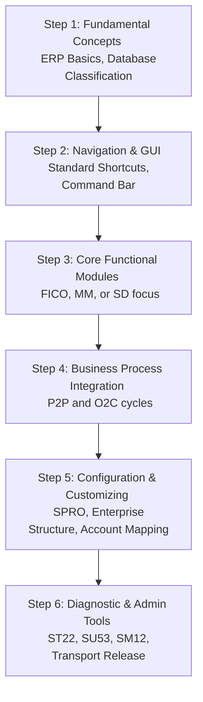

# SAP Learning Roadmap

This guide provides a structured, step-by-step roadmap for students, interns, and beginners to learn SAP ECC and build a professional career as an SAP Consultant or Power User.

---

## The Learning Path

### Step 1: Fundamental Concepts
* **Goals:** Understand what ERP is, why companies use centralized databases, and how different departments coordinate.
* **Topics:** What is ERP? History of SAP, SAP ECC vs. S/4HANA, and difference between Configuration, Master, and Transactional Data.

### Step 2: Navigation & GUI
* **Goals:** Learn how to comfortably navigate the SAP system.
* **Topics:** Logging in, using transaction codes (T-Codes), opening multiple sessions (`/o`), returning to home screen (`/n`), using the command bar, and customizing user profile default values (`SU3`).

### Step 3: Core Module Selection
Focus on one domain to build specialization before branching out:
* **FICO:** Best for Finance, Accounting, and Business Administration backgrounds.
* **MM:** Best for Operations, Supply Chain, and Logistics backgrounds.
* **SD:** Best for Sales, Marketing, and Customer Relations backgrounds.
* **PP / QM / PM:** Best for Manufacturing and Engineering backgrounds.
* **HCM / HR:** Best for Human Resources and Personnel Management backgrounds.
* **ABAP / Basis:** Technical tracks (requires programming or systems administration experience).

### Step 4: Integration Cycles
* **Goals:** Learn how modules talk to one another in real time.
* **Topics:**
  * **Procure-to-Pay (P2P):** Requisition to vendor payment.
  * **Order-to-Cash (O2C):** Sales order to payment clearing.
  * **Plan-to-Produce (P2P):** MRP run to production order settlement.
  * **Record-to-Report (R2R):** G/L ledger updates to Balance Sheet.

### Step 5: Configuration & Customizing (Consultant level)
* **Goals:** Learn how to design system behaviors.
* **Topics:** Accessing the reference IMG via **T-Code `SPRO`**, defining Company Codes, Plants, Sales Areas, assigning units together, configuring payment terms, tax codes, and automatic G/L account determinations (`OBYC`/`VKOA`).

### Step 6: Administration & Diagnostics (Basis/Technical)
* **Goals:** System upkeep and troubleshooting.
* **Topics:** Reading short dumps (`ST22`), checking authorization failures (`SU53`), managing locks (`SM12`), and releasing transport requests (`SE09`/`STMS`).

---

## Recommended Free Learning Resources
1. **OpenSAP (open.sap.com):** Standard free courses provided directly by SAP, featuring certification possibilities.
2. **SAP Learning Hub (learning.sap.com):** Official learning journeys, documentation, and guide modules.
3. **SAP Community (community.sap.com):** Blogs, forums, and Q&A boards where consultants share troubleshooting guides and configuration updates.
4. **ERPGreat / SAP Blogs:** Third-party repository of step-by-step SPRO configuration tutorials.
