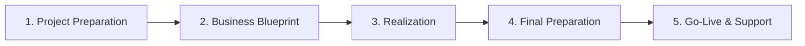

# SAP Project Lifecycle (ASAP Methodology)

Implementing SAP in a large corporation is a massive, multi-month undertaking. To ensure structured execution, SAP developed the **ASAP (Accelerated SAP) Methodology** for classic SAP ECC projects. This guide describes the five phases of the ASAP lifecycle and provides a brief comparison with the modern SAP Activate framework.

---

## 1. The 5 Phases of ASAP Methodology

The ASAP framework splits an SAP implementation project into five logical phases:

### Phase 1: Project Preparation
* **Activities:** Establishing the project scope, defining objectives, appointing steering committees, hiring consultants, purchasing hardware, and establishing the project charter.
* **Goal:** Aligning stakeholders on budgets and timelines.
* **Key Deliverable:** Project Charter and Kick-off meeting.

### Phase 2: Business Blueprint (BBP)
* **Activities:** Functional consultants run workshops with business process owners to gather requirements. They map current workflows ("AS-IS" state) against standard SAP capabilities ("TO-BE" state) to identify gaps.
* **Goal:** Finalize how the business will operate inside SAP.
* **Key Deliverable:** The **Business Blueprint Document** signed off by the customer.

### Phase 3: Realization
* **Activities:** 
  * **Customization:** Functional consultants configure the SPRO implementation guides in the Development Golden client.
  * **Development:** ABAP programmers write custom code (RICEFW objects: Reports, Interfaces, Conversions, Enhancements, Forms, Workflows) to bridge gaps.
  * **Testing:** Performing unit testing (testing individual configurations) and system integration testing (testing end-to-end flows).
* **Goal:** Build and configure the complete system.
* **Key Deliverable:** Configured system in DEV, moved via transport requests to the QAS environment.

### Phase 4: Final Preparation
* **Activities:** 
  * **UAT:** Business key users conduct User Acceptance Testing in QAS.
  * **Data Migration:** Loading master data (material master, vendor records) and open transactional balances from legacy databases to SAP (using tools like LSMW or BD10).
  * **Training:** Conducting classroom sessions and creating user documentation.
  * **Cutover Planning:** Planning the exact calendar of events to switch off legacy databases and boot up SAP.
* **Goal:** Verify that the system and team are ready to go live.
* **Key Deliverable:** Signed-off UAT, loaded master data, and go-live checklist.

### Phase 5: Go-Live & Support
* **Activities:** The old system is turned off, and the SAP system is made active for live business transactions. Consultants remain on-site for "hypercare" support to resolve immediate errors and post-live issues.
* **Goal:** Stabilize the new operational environment.
* **Key Deliverable:** Production system operating smoothly and handed over to the internal Support organization.

---

## 2. ASAP vs. SAP Activate

With the introduction of SAP S/4HANA, SAP transitioned to the **SAP Activate** methodology, which focuses on agile implementation and cloud environments:

| Dimension | ASAP Methodology (ECC) | SAP Activate Methodology (S/4HANA) |
| :--- | :--- | :--- |
| **Project Type** | Traditional Waterfall model. | Agile / Scrum iterative model. |
| **Design Starting Point** | Clean slate (consultants gather requirements from scratch in blueprinting). | Fit-to-Standard (consultants demo standard pre-configured systems to business). |
| **Development Scope** | High emphasis on custom developments (RICEFW). | Standard-first; low-code/no-code extensions. |
| **Phases** | Preparation, Blueprint, Realization, Final Prep, Go-Live. | Discover, Prepare, Explore, Realize, Deploy, Run. |
| **Testing** | Heavy testing at the end of the realization phase. | Continuous testing in short sprints throughout the project. |
