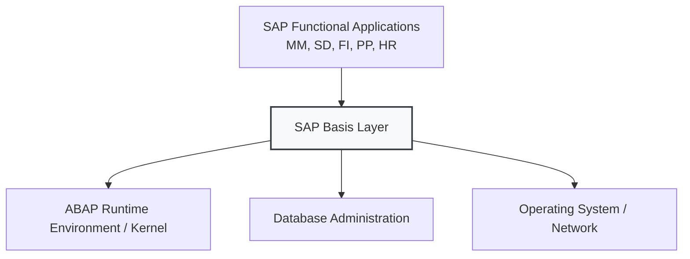
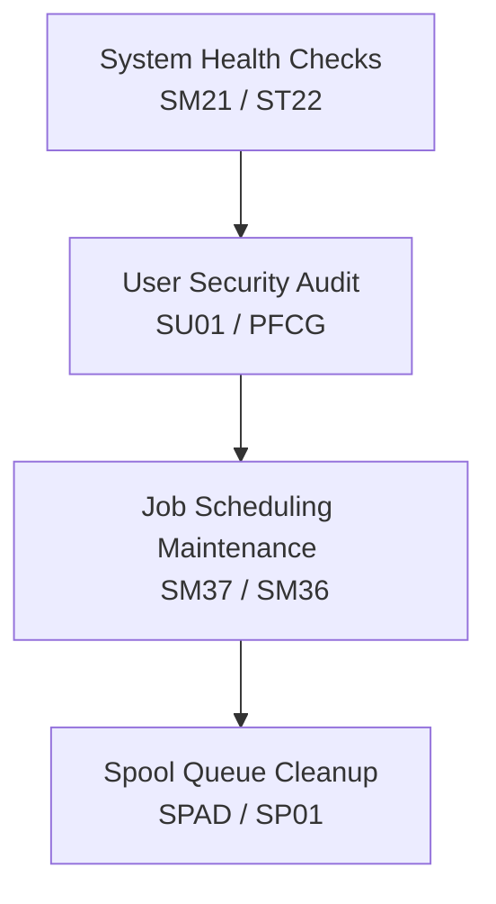

# SAP Basis: System Administration Module

This document provides a comprehensive overview of **SAP Basis**, the system administration, middleware, and technical operating layer of SAP ECC.

---

## 1. Overview & Business Purpose

SAP Basis (Business Application Systems Integrated Solution) is the administrative platform of the SAP environment. It functions like an operating system for SAP applications, managing the communication between the ABAP runtime, the system database, the underlying OS, and the client presentation layer.

### Core Sub-Components & Responsibilities:
1. **User Administration (BC-SEC-USR):** Managing user profiles, security roles, authorizations, and licensing.
2. **Database Administration (BC-DB):** Database tuning, backup configurations, and storage growth tracking.
3. **Background Job Scheduling (BC-CCM-BTC):** Automating processes to run during off-peak hours.
4. **Spool & Print Administration (BC-CCM-PRN):** Routing print documents from SAP to local/network printers.
5. **System Monitoring & Tuning:** Tracking system resources, lock table entries, and kernel updates.

---

## 2. Standard Administrative Workflows

SAP Basis administrators perform routine maintenance cycles, system checks, and configurations:

1. **Daily Health Checks:** Checking for system dumps (`ST22`), system error logs (`SM21`), and lock table overflows (`SM12`).
2. **User Maintenance:** Provisioning new employee profiles and assigning PFCG security roles.
3. **Job Scheduling:** Configuring recurring utility programs or data-maintenance batch runs.
4. **Spool Management:** Monitoring printers, resolving stuck printing requests, and clearing expired print documents.

---

## 3. Important T-Codes & Tables

### Core Transaction Codes
| T-Code | Description | Purpose |
| :--- | :--- | :--- |
| **SU01** | User Maintenance | Create, unlock, edit users, reset passwords |
| **PFCG** | Role Maintenance | Build security roles, define authorization objects, and generate profiles |
| **SM36 / SM37** | Define Background Job / Job Overview | Schedule and monitor batch runs |
| **ST22** | ABAP Runtime Error | View and analyze system dumps (short dumps) from code crashes |
| **SM21** | System Log | View operating system and application log warnings and errors |
| **SM12** | Lock Entries | Display and remove persistent lock table entries (enqueue locks) |
| **SPAD / SP01** | Spool Administration / Spool Controller | Configure printers / Monitor and release printing requests |
| **SM50 / SM51** | Work Process Overview / Server List | Monitor active Dialog/Batch processes on current and remote servers |

### Key Database Tables
| Table | Description | Type of Data |
| :--- | :--- | :--- |
| **USR02** | Logon Data | Master Data (User credentials, status: locked/unlocked, passwords) |
| **AGR_USERS** | Assignment of roles to users | Master Data (Mapping users to their security roles) |
| **AGR_1251** | Authorization data for activity groups | Master Data (Details authorization values inside roles) |
| **TBTCO** | Job Status Table | Transactional Data (Status and runtime details of background jobs) |
| **TSP01** | Spool Requests | Transactional Data (Spool request logs, print file details) |

---

## 4. Troubleshooting Real-World Scenarios

### Scenario A: A user gets a transaction error saying "Express Document Update Terminated."
1. The Basis administrator opens **T-Code `ST22`** to check for ABAP Short Dumps.
2. They identify the dump error (e.g., `SAPSQL_ARRAY_INSERT_DUPREC` - indicating the program tried to write a duplicate primary key record to a database table).
3. The administrator notes the source code line and calls the functional/development team to adjust numbering ranges (`SNRO`).

### Scenario B: A user cannot execute transaction `VA01` (Create Sales Order).
1. The user takes a screenshot of the authorization error.
2. The administrator asks the user to run **T-Code `SU53`** (Authorization Failure Report) immediately after the error.
3. `SU53` reveals the missing authorization object (e.g., `V_VBAK_AAT` - Order Type authorization) and the value requested.
4. The administrator edits the user's role in `PFCG` or assigns the appropriate role.

---

## 5. Basis-Specific Interview Questions

### Q1: What is the SAP Kernel?
**Answer:** The SAP Kernel is the executable engine at the heart of the application layer. Written in C/C++, it compiles and runs ABAP programs, manages system memory, connects to the database, and processes network communication. Updating the kernel (kernel patch) improves system stability and execution speed without modifying the business database tables.

### Q2: What is the difference between a Spool Request and a Output Request?
**Answer:**
* **Spool Request:** A document generated inside the SAP system containing formatted raw data ready for printing. It is stored in the SAP spool database.
* **Output Request:** The physical command sent to a specific printer or device driver to print the Spool Request. One Spool Request can have multiple Output Requests (e.g., printing the same report on three different printers).

### Q3: How do you handle a lock entry that is causing database blocks?
**Answer:**
1. Open **T-Code `SM12`** to locate the lock.
2. Identify the user holding the lock and the table (e.g., `VBAK` being locked by user X).
3. Contact the user to ask if they are actively editing the document (e.g., Sales Order).
4. If the user's GUI session crashed (ghost lock), select the lock entry in `SM12` and click **Delete** to release the database block.
