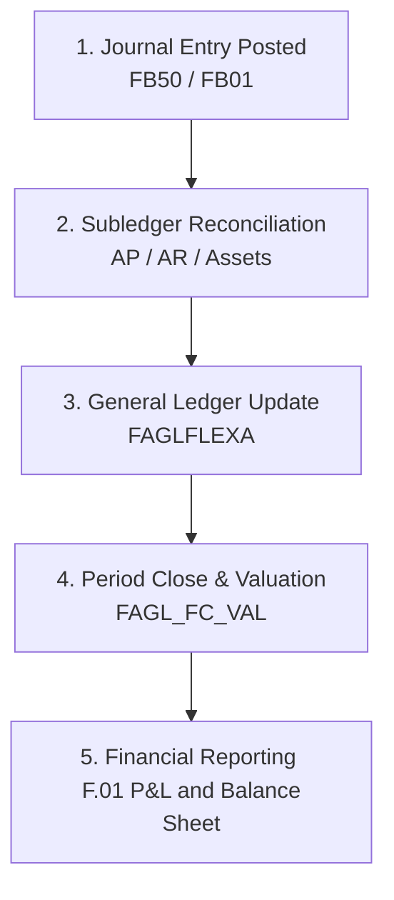

# SAP FICO: Financials and Controlling Module

This document provides a comprehensive breakdown of **SAP FICO (Financial Accounting and Controlling)**, the central financial hub of SAP ECC.

---

## 1. Overview & Business Purpose

SAP FICO is divided into two distinct logical areas designed to meet different reporting requirements:

| Aspect | Financial Accounting (FI) | Controlling (CO) |
| :--- | :--- | :--- |
| **Target Audience** | External reporting (tax authorities, shareholders, auditors). | Internal reporting (management, department heads, executives). |
| **Focus** | Legal compliance, Balance Sheets, Profit & Loss Statements. | Internal profitability, cost tracking, cost center budgets. |
| **Core Components** | G/L, Accounts Payable, Accounts Receivable, Asset Accounting. | Cost Center Accounting, Profit Center Accounting, Product Costing. |

---

## 2. Process Flow: Record to Report (R2R)

The primary business flow within FI is the **Record-to-Report (R2R)** cycle:



1. **Transaction Entry:** Transactions (manual postings, or integrations from SD billing / MM invoice receipts) are recorded.
2. **Subledger Reconciliation:** Customer (AR), Vendor (AP), and Asset subledger postings are synchronized with the central General Ledger via Reconciliation Accounts.
3. **Closing Operations:** Activities performed at month-end or year-end (foreign currency valuation, accrued expenses, depreciation runs).
4. **Financial Statements:** Generating the Balance Sheet and P&L statement.

---

## 3. Important T-Codes & Tables

### Core Transaction Codes
| T-Code | Description | Purpose |
| :--- | :--- | :--- |
| **FB50 / F-02** | Post G/L Document | Record manual journal entries directly to G/L accounts |
| **FB60 / F-90** | Enter Vendor Invoice / Asset | Post vendor invoices without reference to a PO |
| **FB70** | Enter Customer Invoice | Post customer invoices directly in FI |
| **F-53** | Post Outbound Payment | Post cash/bank payment to clear vendor liabilities |
| **F-28** | Post Incoming Payments | Record incoming payments from customers to clear AR invoices |
| **FS00** | G/L Account Centrally | Create and maintain G/L Accounts (Chart of Accounts & Company Code) |
| **FAGLB03** | G/L Account Balance | Display balances and drill-down into G/L transactions |
| **F.01** | Financial Statements | Run Balance Sheet and Profit & Loss reports |

### Key Database Tables
| Table | Description | Type of Data |
| :--- | :--- | :--- |
| **SKA1** | G/L Account Master (Chart of Accounts) | Master Data (Account number, account group, type) |
| **SKB1** | G/L Account Master (Company Code) | Master Data (Currency, reconciliation account indicator) |
| **BKPF** | Accounting Document Header | Transactional Data (Posting date, document type, currency) |
| **BSEG** | Accounting Document Segment | Transactional Data (Line Items: G/L Account, Debit/Credit indicator, Amount) |
| **FAGLFLEXA** | General Ledger Actual Line Items | Transactional Data (New G/L line item table for multi-dimension reporting) |
| **CSKB** | Cost Elements (Data info) | Master Data (CO Cost elements linked to G/L accounts) |
| **CSKS** | Cost Center Master Data | Master Data (Cost center ID, department, owner, validity) |
| **COSP** | CO Object: External Postings | Transactional Data (Cost postings from FI into CO) |

---

## 4. Configuration Basics: The Organizational Setup

The backbone of FICO configuration includes setting up the financial reporting environment:

1. **Company Code (T-Code: `OX02`):** The smallest organizational unit for which a complete set of financial statements (Balance Sheet, P&L) can be generated.
2. **Chart of Accounts (T-Code: `OB13`):** The list of all G/L account definitions. Multiple Company Codes can share a single Chart of Accounts.
3. **Fiscal Year Variant (T-Code: `OB29`):** Defines the posting periods (usually 12 posting periods and up to 4 special periods for audit adjustments).
4. **Posting Period Variant (T-Code: `OB52`):** Controls which posting periods are open or closed for user postings.

```
SAP Customizing Implementation Guide 
  └── Financial Accounting 
        ├── Financial Accounting Global Settings 
        │     └── Company Code -> Enter Global Parameters
        └── General Ledger Accounting
              └── G/L Accounts -> Master Data -> Preparations -> Edit Chart of Accounts List
```

---

## 5. Real-World Use Case

**Scenario:** A company rents a corporate office.
1. The landlord sends a monthly rent invoice.
2. The AP accountant posts the invoice directly in FI using T-Code `FB60`.
   * **Debit Rent Expense G/L Account** (e.g., `400010`) - **Cost Center: `ADMIN`** (CO target)
   * **Credit Landlord Vendor Account** (subledger reconciles to Accounts Payable G/L account)
3. During posting, the **Controlling (CO)** module immediately intercepts the expense. Since G/L Account `400010` is defined as a Primary Cost Element, the cost of $5,000 is written to Cost Center `ADMIN` (Table `COSP`).
4. At month-end, the AP team runs `F-53` to pay the landlord via bank transfer.
   * **Debit Landlord Vendor Account** (clears liability)
   * **Credit Bank G/L Account**

---

## 6. FICO-Specific Interview Questions

### Q1: What is a Reconciliation Account in SAP FI?
**Answer:** A reconciliation account is a special G/L account that links the subledgers (like Accounts Payable, Accounts Receivable, Asset Accounting) to the central General Ledger in real-time. Direct manual postings cannot be made to reconciliation accounts. When you post an invoice to a customer (subledger), the system automatically updates the designated AR Reconciliation G/L account.

### Q2: What is the difference between a Primary Cost Element and a Secondary Cost Element?
**Answer:**
* **Primary Cost Element:** Integrates FI and CO. It corresponds directly to an expense G/L account in FI. (e.g., salaries, rent).
* **Secondary Cost Element:** Exists purely within the Controlling (CO) module. It is used for internal allocations, assessments, and distributions between cost centers. It has no corresponding G/L account in FI.

### Q3: What is "New G/L" in SAP ECC?
**Answer:** The "New G/L" (introduced in ECC 6.0) combines G/L, profit center accounting, segment reporting, and cost-of-sales accounting into a single ledger structure (using tables like `FAGLFLEXA`/`FAGLFLEXT`). It enables parallel accounting (multiple ledgers for different local/global standards like US GAAP and IFRS) and real-time document splitting (splitting tax or cash lines automatically by profit center or business segment).
