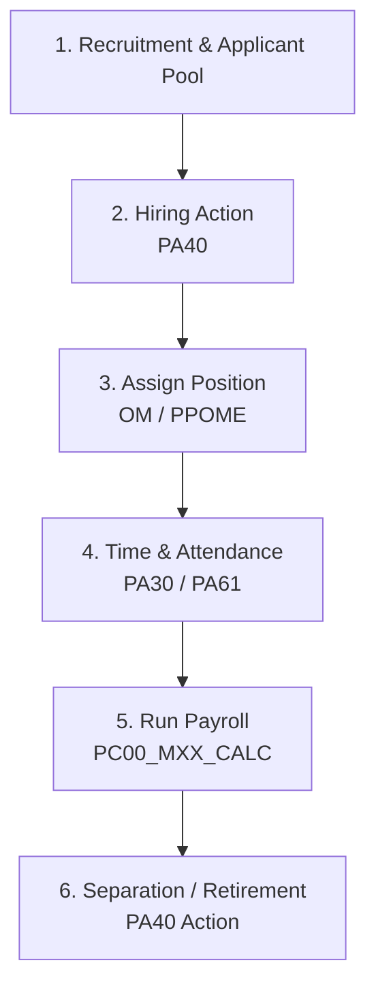

# SAP HCM: Human Capital Management Module

This document provides a comprehensive breakdown of the **SAP HCM (Human Capital Management)** module (formerly known as SAP HR), which manages employee lifecycle data and payroll.

---

## 1. Overview & Business Purpose

SAP HCM integrates core human resources functions, ensuring administrative efficiency, payroll accuracy, legal compliance, and talent development. It keeps track of organizational Hierarchies, employee master data, time tracking, and compensation.

### Core Sub-Components:
1. **Personnel Administration (PA):** Managing employee records, contracts, addresses, and hire details.
2. **Organizational Management (OM):** Structuring jobs, positions, departments, and reporting relationships.
3. **Time Management (PT):** Logging work hours, shift schedules, vacation, and sick leave.
4. **Payroll (PY):** Calculating gross and net pay, deductions, tax compliance, and bank transfers.
5. **Talent Management (PA-TM):** Recruitment, training, career path planning, and performance management.

---

## 2. Process Flow: Hire to Retire (H2R)

The primary business flow within HCM is the **Hire-to-Retire (H2R)** lifecycle:



1. **Recruitment:** Candidate profiles are evaluated and an offer is made.
2. **Hiring Action:** Initiated in `PA40`. Executes an infotype sequence to capture personal data, address, bank info, and base salary.
3. **Organizational Assignment:** The employee is assigned to a Position (`Position`) which rolls up to an Organizational Unit (`Org Unit`) under a Job.
4. **Time & Attendance Tracking:** Employee logs time, or shifts are assigned.
5. **Payroll Processing:** System reads employee infotypes (salary, deductions, hours worked) and runs calculations, sending payments to banks and updating G/L accounts in FI.
6. **Separation:** Executing retirement/termination actions when the employee leaves.

---

## 3. Important T-Codes & Tables

### Core Transaction Codes
| T-Code | Description | Purpose |
| :--- | :--- | :--- |
| **PA30 / PA40** | Maintain HR Master Data / Actions | Add/Edit Infotypes / Run Hiring, Transfer, or Termination Actions |
| **PA20** | Display HR Master Data | View infotype settings for an individual employee |
| **PPOME** | Change Org Structure | Graphical editor to maintain Org Units, Positions, and Assignments |
| **PPOSE** | Display Org Structure | View departments and position hierarchies |
| **PC00_M99_CALC** | Payroll Driver | Run international payroll (replace 99 with country code, e.g., M10 for USA) |
| **PA61 / PA51** | Maintain Time Data / Display | Manage employee clock-in times, absences, and attendances |

### Key Database Tables
SAP HCM uses **Infotypes** (4-digit numeric identifiers) which map to underlying physical tables (prefixed with `PA` followed by the infotype number).

| Table / Infotype | Description | Type of Data |
| :--- | :--- | :--- |
| **PA0001** (Infotype 0001) | Organizational Assignment | Company Code, Plant, Cost Center, Org Unit, Position |
| **PA0002** (Infotype 0002) | Personal Data | First name, last name, birth date, gender, SSN |
| **PA0006** (Infotype 0006) | Addresses | Permanent address, emergency contacts |
| **PA0008** (Infotype 0008) | Basic Pay | Salary grade, pay scale, monthly salary, allowances |
| **HRP1000** | OM Object | Master table for OM Objects (O = Org Unit, S = Position, C = Job) |
| **HRP1001** | OM Relationships | Links objects together (e.g., Position belongs to Org Unit) |

---

## 4. Configuration Basics: Enterprise vs. Personnel Structure

The core configuration in HCM defines how employees are grouped:

```
SAP Customizing Implementation Guide 
  └── Enterprise Structure 
        ├── Definition 
        │     └── Human Resources -> Personnel Areas / Personnel Subareas
        └── Assignment
              └── Human Resources -> Assign Personnel Area to Company Code
```

* **Personnel Area:** Represents a geographic location or business division. It is assigned to a Company Code (e.g., Personnel Area `1000` = New York Office).
* **Personnel Subarea:** A subset of Personnel Area used to determine labor policies, shift plans, and public holiday calendars (e.g., Subarea `0001` = Salaried Employees, `0002` = Hourly Plant Workers).
* **Employee Group:** Broad categorization (e.g., Active Employees, External Contractors, Pensioners).
* **Employee Subgroup:** Finer breakdown under Employee Group used to control salary grades and payroll rules (e.g., Non-exempt, Exempt).

---

## 5. Real-World Use Case

**Scenario:** Hiring a new software developer in the London office.
1. The HR specialist opens T-Code `PA40` and selects the "Hiring" Action.
2. The specialist fills out the sequential screens (**Infotypes**):
   * **IT0000 (Actions):** Captures the Hire Date.
   * **IT0001 (Org Assignment):** Assigns Position `50004123` (Software Developer) under Org Unit `IT_DEP` (IT Department). The system automatically retrieves Company Code `UK01` and Cost Center `IT_COST`.
   * **IT0002 (Personal Data):** Input Name and Date of Birth.
   * **IT0008 (Basic Pay):** Input Salary Grade `G7` with a monthly base pay of £5,000.
3. When Payroll runs at month-end (`PC00_M08_CALC` for UK), the system reads Infotypes `0001` and `0008`, calculates income tax and social insurance deductions, registers bank transfer details from `IT0009` (Bank Details), and posts the salary expense to FI.

---

## 6. HCM-Specific Interview Questions

### Q1: What is an "Infotype" in SAP HR?
**Answer:** An infotype is a logical grouping of related data fields containing temporal validity dates (start date and end date). They are designated by a 4-digit number (e.g., `0001` for Org Assignment, `0002` for Personal Data). Infotypes track history; when data changes, a new record is created with a new start date, while the previous record's end date is updated, maintaining a complete historical audit trail.

### Q2: What is the purpose of the "Feature" (PE03) in SAP HCM?
**Answer:** Features are decision trees used to return default values to infotype fields based on an employee's organizational characteristics. For example, the Feature `NUMKR` returns the number range for assigning employee numbers, and Feature `PINCH` defaults the Administrator group based on Company Code or Personnel Area.

### Q3: What is the difference between a Job and a Position in Organizational Management?
**Answer:**
* **Job (Object C):** A general classification or role within the company (e.g., "Software Engineer", "Manager").
* **Position (Object S):** A specific, concrete instance of a Job that can be occupied by a person (e.g., "Senior Software Engineer - Team A", Position ID `50004523`). Positions are occupied by employees (Object P), whereas Jobs are not.
