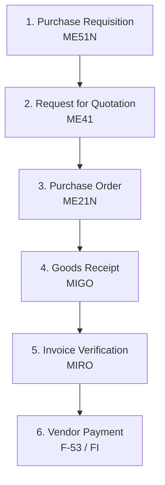

# SAP MM: Materials Management Module

This document provides a comprehensive breakdown of the **SAP MM (Materials Management)** module, which handles the procurement and inventory functions of an enterprise.

---

## 1. Overview & Business Purpose

SAP MM manages materials from initial procurement planning to warehouse receipt and final invoice verification. Its primary business objective is to ensure that materials, services, and inventory are managed efficiently with minimal inventory costs, zero stock-outs, and streamlined vendor interactions.

### Core Sub-Components:
1. **Purchasing (MM-PUR):** Purchase Requisitions, Purchase Orders, RFQs, Contracts.
2. **Inventory Management (MM-IM):** Goods Receipts, Goods Issues, Stock Transfers, Physical Inventory.
3. **Invoice Verification (MM-IV):** Three-way matching (PO vs. Goods Receipt vs. Vendor Invoice).
4. **Valuation & Account Determination (MM-VAL):** Setting up GL mappings for material movements.

---

## 2. Process Flow: Procure to Pay (P2P)

The primary business flow within MM is the **Procure-to-Pay (P2P)** cycle:



1. **Purchase Requisition (PR):** Internal document created by a department requesting materials or services.
2. **RFQ & Quotation Maintenance:** Sent to vendors to obtain pricing. The best vendor is selected.
3. **Purchase Order (PO):** External legal contract sent to the chosen vendor specifying quantities, price, and delivery terms.
4. **Goods Receipt (GR):** Created when materials arrive at the plant. Generates a Material Document (inventory up) and Accounting Document (financial entry).
5. **Invoice Verification (IV):** Checking the vendor's invoice against the PO price and GR quantity (3-way match).
6. **Payment:** Handled in the Financial Accounting (FI) module.

---

## 3. Important T-Codes & Tables

### Core Transaction Codes
| T-Code | Description | Purpose |
| :--- | :--- | :--- |
| **MM01 / MM02 / MM03** | Material Master | Create / Change / Display Material Records |
| **ME51N / ME52N / ME53N** | Purchase Requisition | Create / Change / Display PR |
| **ME21N / ME22N / ME23N** | Purchase Order | Create / Change / Display PO |
| **MIGO** | Goods Movement | Execute Goods Receipt, Goods Issue, Transfer Posting |
| **MIRO** | Enter Inbound Invoice | Post vendor invoices and execute 3-way match |
| **MB51** | Material Doc List | Run reports on historical material stock movements |
| **MMBE** | Stock Overview | View real-time stock levels across Plants & Storage Locations |

### Key Database Tables
| Table | Description | Type of Data |
| :--- | :--- | :--- |
| **MARA** | General Material Data | Master Data (Material number, base unit, material type) |
| **MARC** | Plant Data for Material | Master Data (MRP parameters, purchasing settings per Plant) |
| **MARD** | Storage Location Data | Master Data (Storage location specific stock levels) |
| **LFA1** | Vendor Master (General) | Master Data (Vendor address, bank details) |
| **EKKO** | Purchasing Document Header | Transactional Data (PO Header: Vendor, Date, Purchasing Org) |
| **EKPO** | Purchasing Document Item | Transactional Data (PO Line Items: Material, Quantity, Price, Plant) |
| **MSEG** | Document Segment: Material | Transactional Data (Material Document lines: stock postings) |
| **MKPF** | Header: Material Document | Transactional Data (Material Document Header: Date, User) |

---

## 4. Configuration Basics

Establishing the MM organizational structure and account integration rules requires accessing the SAP Reference IMG (`SPRO`):

```
SAP Customizing Implementation Guide 
  └── Enterprise Structure 
        ├── Definition 
        │     └── Materials Management -> Maintain Purchasing Organization
        └── Assignment
              ├── Logistics - General -> Assign Plant to Company Code
              └── Materials Management -> Assign Purchasing Organization to Plant
```

### Account Determination (OMWB / OBYC):
One of the most complex parts of MM setup. It links material movements to G/L accounts automatically:
* **Movement Type:** (e.g., `101` for Goods Receipt) triggers a Transaction/Event Key.
* **Valuation Class:** Stored on the Material Master (Accounting view).
* **OBYC Mapping:** Maps the combination of Valuation Class and Transaction Key (e.g., `BSX` for Stock, `WRX` for GR/IR Clearing) to a specific General Ledger (G/L) Account.

---

## 5. Real-World Use Case

**Scenario:** A manufacturing company needs to buy steel sheets for production.
1. The MRP system detects steel levels are below safety stock and automatically creates a **PR**.
2. The purchasing agent turns the PR into a **PO** using T-Code `ME21N`, using the contract price negotiated for Vendor A.
3. The delivery truck arrives. The warehouse worker uses `MIGO` (Goods Receipt) to scan the delivery note, placing the steel into Plant `1000` under Storage Location `0001`. The stock quantity increases.
4. An accounting entry is posted: **Debit Raw Materials (BSX)** and **Credit GR/IR Clearing Account (WRX)**.
5. The vendor sends an invoice. The accountant posts it via `MIRO`. If the invoice matches the PO and GR, the **GR/IR clearing account is cleared (Debited)** and the **Vendor Account is credited (AP)**.

---

## 6. MM-Specific Interview Questions

### Q1: What is the purpose of the GR/IR Clearing account?
**Answer:** The GR/IR (Goods Receipt / Invoice Receipt) is a temporary clearing account that acts as a bridge. When a Goods Receipt is posted before the invoice is received, the stock value increases, and the offset is credited to GR/IR. When the invoice arrives, the invoice is debited to GR/IR and credited to the vendor. By the end of the process, the GR/IR balance for that PO returns to zero.

### Q2: What is the difference between a Purchase Requisition (PR) and a Purchase Order (PO)?
**Answer:** A PR is an internal request within the organization (e.g., a production supervisor requesting spare parts). It has no legal commitment. A PO is a legally binding external document sent to a vendor to supply specific goods or services under agreed-upon conditions.

### Q3: How does the system determine the G/L account during a Goods Receipt?
**Answer:** Through **Automatic Account Determination** (T-Code `OBYC`). The system reads:
1. The **Chart of Accounts** (determined by Plant -> Company Code).
2. The **Valuation Grouping Code** (grouping plants for account assignment).
3. The **Transaction/Event Key** (e.g., `BSX` for inventory postings based on the movement type `101`).
4. The **Valuation Class** (retrieved from the Material Master's Accounting 1 view).
Based on this lookup table, it finds the configured G/L account number.
