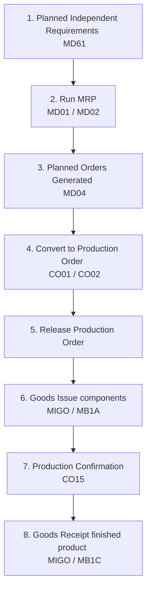

# SAP PP: Production Planning Module

This document provides a comprehensive breakdown of the **SAP PP (Production Planning)** module, which manages the manufacturing processes of an enterprise.

---

## 1. Overview & Business Purpose

SAP PP ensures that manufacturing resources, capacities, and materials are aligned to meet sales demand. It handles demand management, capacity planning, Material Requirements Planning (MRP), and the tracking of physical shop floor production execution.

### Core Sub-Components:
1. **Sales and Operations Planning (SOP):** High-level sales forecasting and production planning.
2. **Demand Management (PP-MP):** Defining Planned Independent Requirements (PIRs) based on forecasts.
3. **Material Requirements Planning (MRP):** Calculating net requirements of raw materials based on production schedules and bill of materials.
4. **Shop Floor Control (PP-SFC):** Executing production orders, confirmations, and goods movements.
5. **Capacity Planning (PP-CRP):** Aligning work center capacities with production demands.

---

## 2. Process Flow: Plan to Produce

The primary business flow within PP is the **Plan-to-Produce** lifecycle:

1. **Demand (PIR):** Inputting the forecasted sales quantities.
2. **MRP Run:** System analyzes existing inventory, sales orders, and PIRs, and executes calculations to output planned orders for assemblies and purchase requisitions for raw components.
3. **Production Order:** Converts planned manufacturing into a formal production execution document.
4. **Order Release:** Authorization to start manufacturing on the shop floor.
5. **Goods Issue (GI):** Issuing raw components to the production line (reduces raw material inventory).
6. **Confirmation:** Logging execution time, labor hours, and quantities completed at individual work centers.
7. **Goods Receipt (GR):** Receiving the finished goods into warehouse inventory (increases finished goods inventory).

---

## 3. Important T-Codes & Tables

### Core Transaction Codes
| T-Code | Description | Purpose |
| :--- | :--- | :--- |
| **MD61 / MD62 / MD63** | Maintain PIR | Input and maintain Planned Independent Requirements |
| **MD01 / MD02** | Run MRP | Run MRP at Plant / Material level |
| **MD04** | Stock/Requirements List | Real-time dynamic status list of stock, sales orders, POs, and PIRs |
| **CO01 / CO02 / CO03** | Production Order | Create / Change / Display Production Orders |
| **CO11N / CO15** | Confirmation | Confirm production operations / Order header confirmation |
| **CR01 / CR02 / CR03** | Work Center | Create / Change / Display Work Center |
| **CS01 / CS02 / CS03** | Bill of Material | Create / Change / Display Material BOM |
| **CA01 / CA02 / CA03** | Routing | Create / Change / Display Routing steps |

### Key Database Tables
| Table | Description | Type of Data |
| :--- | :--- | :--- |
| **MAST** | Material to BOM Link | Master Data (Maps material to Bill of Material number) |
| **STKO** | BOM Header | Master Data (BOM categories, validity dates) |
| **STPO** | BOM Item Details | Master Data (Components, quantities, waste margins) |
| **MAPL** | Routing Link | Master Data (Maps Material to Routing Group) |
| **PLKO** | Routing Header | Master Data (Routing parameters) |
| **PLPO** | Routing Operation details | Master Data (Sequence of steps, work centers, activity times) |
| **CRHD** | Work Center Header | Master Data (Work center ID, category, capacity references) |
| **AUFK** | Order Headers | Transactional Data (Production order numbers, types, status) |
| **AFKO** | Order Header Data PP | Transactional Data (Quantities, schedules, MRP dates) |
| **AFPO** | Order Item Data | Transactional Data (Output materials, batch numbers) |

---

## 4. Master Data Elements in SAP PP

Production planning relies heavily on four core master data records:

1. **Bill of Material (BOM):** The recipe or structured list of all raw ingredients, packaging, or components required to manufacture a finished or semi-finished product.
2. **Work Center:** The physical location in the plant where manufacturing operations are executed (e.g., assembly line, machine tool, packaging station). Defines capacity and labor costing parameters.
3. **Routing:** A sequential checklist of operations required to make a product. It specifies which work centers are used, the sequence of operations, and the setup and machine times required.
4. **Production Version:** Links a specific BOM with a specific Routing to determine the standard manufacturing route.

---

## 5. Real-World Use Case

**Scenario:** A factory manufactures bicycles.
1. The SOP forecast expects 1,000 bicycles to be sold next month, which is loaded as a **PIR** (`MD61`).
2. The planner runs **MRP** (`MD02`).
   * The system checks the BOM for Bicycles: it needs 1 frame, 2 wheels, and 1 chain per bike.
   * There are only 500 wheels in stock. MRP automatically generates a **Purchase Requisition** for 1,500 wheels and a **Planned Order** to manufacture 1,000 Bicycles.
3. The Planned Order is converted into a **Production Order** (`CO01`).
4. The warehouse issues raw frames, chains, and wheels to the assembly line using `MIGO` (Goods Issue).
5. At the work center `ASSY_LINE`, workers assemble the bikes and log confirmations (`CO11N`) for hours worked.
6. Once complete, the production lead posts a Goods Receipt (`MIGO` - Movement Type `101`) to place 1,000 finished bicycles into inventory.

---

## 6. PP-Specific Interview Questions

### Q1: What is the difference between Discrete Manufacturing and Process Manufacturing in SAP PP?
**Answer:**
* **Discrete Manufacturing:** Production of individual, distinct, countable items (e.g., cars, laptops, bicycles) using Production Orders.
* **Process Manufacturing:** Continuous production or batch recipes where ingredients are blended or chemically altered and cannot be disassembled (e.g., chemicals, beverages, pharmaceuticals) using Process Orders (PP-PI).

### Q2: What does MRP do when it runs?
**Answer:** MRP (Material Requirements Planning) performs a net requirements calculation. It:
1. Checks current stock levels.
2. Identifies gross requirements (Sales Orders, Forecast PIRs).
3. Evaluates scheduled receipts (Purchase Orders, existing Production Orders).
4. Calculates shortages (Net Requirement = Stock + Scheduled Receipts - Gross Requirements).
5. Generates planned orders or purchase requisitions to cover shortages based on lot-sizing rules.

### Q3: What is T-Code `MD04` and why is it so important?
**Answer:** `MD04` (Stock/Requirements List) is the most critical dynamic tool for production planners. It displays a real-time ledger of all demands (sales orders, PIRs) and supply (stock, purchase orders, production orders) for a specific material. Planners use it to inspect the status of planning and convert planned orders directly.
