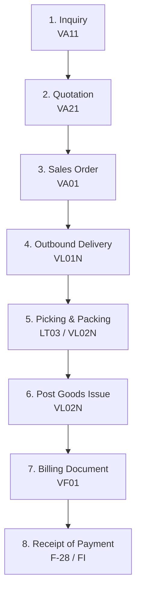

# SAP SD: Sales and Distribution Module

This document provides a comprehensive breakdown of the **SAP SD (Sales and Distribution)** module, which manages the customer-facing business processes of an enterprise.

---

## 1. Overview & Business Purpose

SAP SD handles shipping, billing, selling, and transportation of products and services for a company. It coordinates customer transactions from pre-sales inquiries, sales order creation, and physical shipping, to final customer billing and accounts receivable integration.

### Core Sub-Components:
1. **Pre-Sales (SD-CAS):** Inquiries, Quotations, Customer contacts.
2. **Sales Order Processing (SD-SLS):** Creating Sales Orders, Contract Management, Scheduling Agreements.
3. **Shipping (SD-SHP):** Delivery note creation, Picking, Packing, Goods Issue (PGI).
4. **Billing (SD-BIL):** Invoicing, Debit/Credit Memos, Rebate processing.
5. **Pricing (SD-BF-PR):** Pricing conditions, discounts, surcharges, taxes.

---

## 2. Process Flow: Order to Cash (O2C)

The primary business flow within SD is the **Order-to-Cash (O2C)** cycle:

1. **Inquiry / Quotation:** Pre-sales documents detailing pricing and availability provided to a prospective client.
2. **Sales Order (SO):** Formal agreement between the company and customer for specific quantities and delivery dates. Triggers availability checks (ATP).
3. **Outbound Delivery:** The shipping document created to initiate picking of products from the warehouse.
4. **Picking & Packing:** Organizing items in the warehouse and wrapping them for transport.
5. **Post Goods Issue (PGI):** Physical departure of goods from the plant. Ownership is transferred to the customer. Reduces inventory levels and creates a financial entry.
6. **Billing Document:** The invoice sent to the customer requesting payment. Registers Accounts Receivable.

---

## 3. Important T-Codes & Tables

### Core Transaction Codes
| T-Code | Description | Purpose |
| :--- | :--- | :--- |
| **VA01 / VA02 / VA03** | Sales Order | Create / Change / Display Sales Order |
| **VL01N / VL02N / VL03N** | Outbound Delivery | Create / Change / Display Shipping Delivery |
| **VF01 / VF02 / VF03** | Billing | Create / Change / Display Customer Invoices |
| **VA11 / VA12 / VA13** | Customer Inquiry | Create / Change / Display Customer Inquiries |
| **VA21 / VA22 / VA23** | Quotation | Create / Change / Display Quotations |
| **XD01 / XD02 / XD03** | Customer Master | Create / Change / Display Customer Records (Central) |
| **VK11 / VK12 / VK13** | Condition Records | Maintain pricing, discounts, and tax conditions |

### Key Database Tables
| Table | Description | Type of Data |
| :--- | :--- | :--- |
| **KNA1** | Customer General Data | Master Data (Name, address, country) |
| **KNVV** | Customer Sales Data | Master Data (Sales Area, shipping conditions, currency) |
| **VBAK** | Sales Document Header | Transactional Data (Order date, Sold-to Party, Net value) |
| **VBAP** | Sales Document Item | Transactional Data (Order lines: Material, quantities, item category) |
| **LIKP** | SD Document: Delivery Header | Transactional Data (Delivery Header: Ship-to party, weight, routes) |
| **LIPS** | SD Document: Delivery Item | Transactional Data (Delivery lines: materials picked, storage locations) |
| **VBRK** | Billing Document Header | Transactional Data (Invoice Header: Payer, billing date, currency) |
| **VBRP** | Billing Document Item | Transactional Data (Invoice lines: billed quantities, net value, accounts) |
| **VBFA** | Document Flow | Transactional Data (Links relationships between SO, Delivery, and Invoice) |

---

## 4. Configuration Basics: The Pricing Procedure

The **Pricing Procedure** is the heart of SD customization. It determines how base prices, discounts, freight, and taxes are calculated dynamically using the **Condition Technique**:

1. **Condition Table:** Defines fields for key combinations (e.g., Customer / Material / Sales Org).
2. **Access Sequence:** A search strategy that tells the system where to look for condition records in order of priority (most specific to most general).
3. **Condition Type:** Represents a pricing element (e.g., `PR00` for Base Price, `K007` for Customer Discount, `MWST` for Sales Tax).
4. **Pricing Procedure (T-Code: `V/08`):** Defines the list of Condition Types, their execution sequence, and subtotal calculation steps.
5. **Determination (T-Code: `OVKK`):** Assigns the Pricing Procedure based on:
   * Sales Area (Sales Org + Dist. Channel + Division)
   * Document Pricing Procedure (from Sales Doc Type)
   * Customer Pricing Procedure (from Customer Master)

---

## 5. Real-World Use Case

**Scenario:** A retail distributor orders 50 office chairs.
1. The sales representative creates a sales order via `VA01`. The system automatically checks stock availability (ATP check) and determines the price: Base Price $100 - Customer Discount 5% = Net Price $95 per chair.
2. Once the delivery date arrives, a shipping clerk creates an outbound delivery (`VL01N`).
3. Warehouse staff pick 50 chairs from storage location `0001` and pack them.
4. The clerk posts **PGI** (`VL02N`).
   * **Accounting Posting:** Debit Cost of Goods Sold (COGS) and Credit Inventory.
5. The billing clerk runs `VF01` to generate the invoice.
   * **Accounting Posting:** Debit Customer Accounts Receivable (FI-AR) and Credit Sales Revenue.
6. The customer pays, and the invoice is cleared in FI.

---

## 6. SD-Specific Interview Questions

### Q1: What is the purpose of the table `VBFA`?
**Answer:** `VBFA` is the Sales Document Flow table. It tracks the complete document trail of a sales cycle. For example, if you want to find the Outbound Delivery or Invoice associated with a specific Sales Order, you query `VBFA` using the Sales Order number as the preceding document.

### Q2: What is the difference between a "Sold-to Party" and a "Ship-to Party"?
**Answer:** 
* **Sold-to Party:** The customer who places the order and holds the legal contract.
* **Ship-to Party:** The physical address where the goods are delivered. They can be different (e.g., corporate office buys goods but wants them shipped to a regional warehouse).

### Q3: What is Post Goods Issue (PGI) and what happens when it is executed?
**Answer:** PGI is the final step in the shipping process. It records that goods have left the company's warehouse. When PGI is run:
1. Physical inventory quantity decreases.
2. Accounting posts the value change (Debits Cost of Goods Sold, Credits Inventory).
3. Delivery status changes to "Completed" for shipping.
4. The billing index is updated, making the delivery eligible for invoicing.
