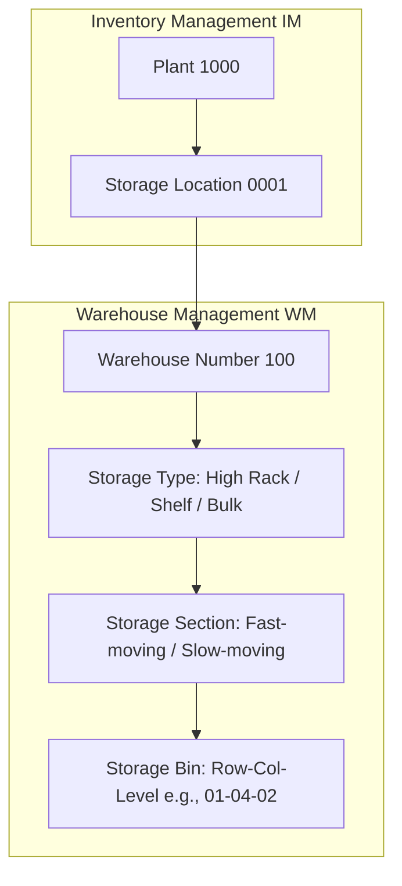
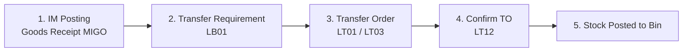

# SAP WM: Warehouse Management Module

This document provides a comprehensive breakdown of the **SAP WM (Warehouse Management)** module, which manages physical inventory at the bin level.

---

## 1. Overview & Business Purpose

While **Inventory Management (IM)** manages stock levels in terms of quantity and value at the *Storage Location* level (e.g., Plant 1000 has 50 units of item A), **Warehouse Management (WM)** manages the exact physical location of that stock down to the *Storage Bin* level (e.g., Row 4, Shelf 2, Bin A1).

### Core Sub-Components:
1. **Goods Receipts / Putaway (WM-PP):** Directing arriving stock to the optimal physical bins.
2. **Goods Issues / Picking (WM-PF):** Locating and retrieving materials for deliveries or production.
3. **Internal Stock Movements (WM-IM):** Bin-to-bin transfers and physical inventory counts.

---

## 2. Process Flow: Stock Movement in WM

Stock movement in WM is managed using **Transfer Requirements** and **Transfer Orders**:

1. **Inventory Postings:** A Goods Receipt (`MIGO`) in IM creates a material document.
2. **Transfer Requirement (TR):** An intermediate planning document created automatically by the IM posting, requesting the movement of stock.
3. **Transfer Order (TO):** The execution document indicating the source bin (e.g., interim GR area `902`) and target bin.
4. **TO Confirmation:** Once physical stock is placed or picked, the warehouse worker confirms the TO in the system. The transfer is complete.

---

## 3. Important T-Codes & Tables

### Core Transaction Codes
| T-Code | Description | Purpose |
| :--- | :--- | :--- |
| **LT01** | Create Transfer Order | Create a TO for general stock movements |
| **LT03** | Create TO for Delivery | Create a TO to pick items for an Outbound Delivery |
| **LT12** | Confirm Transfer Order | Confirm that physical bin placement or picking has completed |
| **LS01N / LS02N / LS03N** | Storage Bin | Create / Change / Display Storage Bins |
| **LS24** | Bin Stock Overview | View what materials and quantities are stored in a specific bin |
| **LL01** | Warehouse Activity Monitor | Identify stuck transfers, unconfirmed TOs, or critical log items |
| **LX02** | Stock List | Generate warehouse-wide stock inventory sheets |

### Key Database Tables
| Table | Description | Type of Data |
| :--- | :--- | :--- |
| **LQUA** | Quants | Transactional Data (Actual stock quantities inside individual storage bins) |
| **LAGP** | Storage Bins | Master Data (Bin address, storage type, coordinates) |
| **LTAK** | WM Transfer Order Header | Transactional Data (TO Number, date, user, source/dest flags) |
| **LTAP** | WM Transfer Order Item | Transactional Data (TO Lines: Material, quantities, source/target bin) |
| **LTBK** | Transfer Requirement Header | Transactional Data (TR Number, movement indicators) |
| **LTBP** | Transfer Requirement Item | Transactional Data (TR Lines: Material, requested quantities) |

---

## 4. Configuration Basics: Warehouse Structure

Configuring WM involves linking the logical IM world with the physical WM layout:

1. **Warehouse Number Assign (T-Code: `EC09`):** Create the 3-digit Warehouse Number.
2. **Link IM Storage Location to WM (T-Code: `OMLY`):** Connect Plant + Storage Location combination to the Warehouse Number.
3. **Maintain Storage Types (T-Code: `OML1`):** Define zones like:
   * `001` (High rack storage)
   * `002` (Shelf storage)
   * `902` (Interim storage area for Goods Receipts)

---

## 5. Real-World Use Case

**Scenario:** A delivery truck arrives with 10 pallets of engine oil.
1. The receiving agent posts a Goods Receipt (`MIGO`).
2. The IM system registers stock increase under Storage Location `0001`. Since this storage location is linked to Warehouse `100`, the system automatically posts the stock to an **Interim Storage Area `902` (Bin: Purchase Order number)** and generates a **Transfer Requirement (TR)**.
3. A warehouse coordinator converts the TR into a **Transfer Order (TO)**. The system utilizes *Putaway Strategies* (e.g., "Next Empty Bin") and automatically assigns target bin `01-12-03` in High Rack Storage Type `001`.
4. A forklift operator prints the TO, drives to Interim Area `902`, picks up the pallets, places them in bin `01-12-03`, and confirms the TO using `LT12`.
5. The stock is removed from `902` and formally registered in the high rack.

---

## 6. WM-Specific Interview Questions

### Q1: What is a "Quant" in SAP WM?
**Answer:** A Quant is the lowest level of stock representation in WM. It represents a specific material, batch, stock category, and quantity residing in a single storage bin. Quants are created and deleted dynamically by the system (stored in table `LQUA`); you cannot create a quant manually.

### Q2: What is an Interim Storage Area?
**Answer:** Interim storage areas are logical interfaces between Inventory Management (IM) and Warehouse Management (WM). They are designated with 9-series codes (e.g., `901` for GR production, `902` for GR external procurement, `916` for shipping deliveries). When a movement happens in IM, it is temporarily parked in an interim area until the corresponding Transfer Order is executed in WM to move it to a physical storage bin.

### Q3: What is the difference between Putaway and Picking strategies?
**Answer:**
* **Putaway Strategy:** The logic the system uses to find the best bin to *store* incoming goods (e.g., Empty Bin, Addition to Existing Stock, Bulk Storage).
* **Picking Strategy:** The logic the system uses to find the best bin to *retrieve* goods (e.g., FIFO - First In First Out, LIFO - Last In First Out, Expiration Date).
